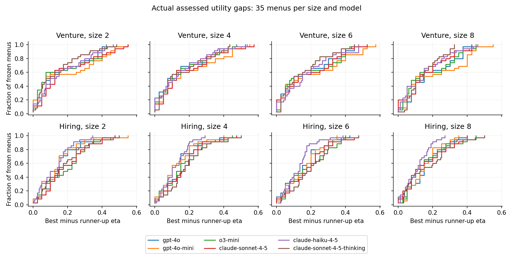
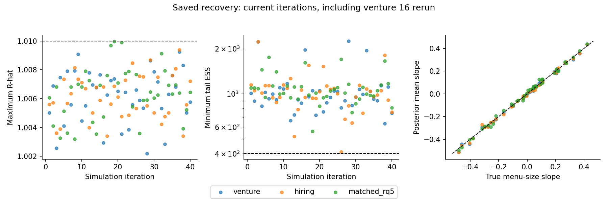
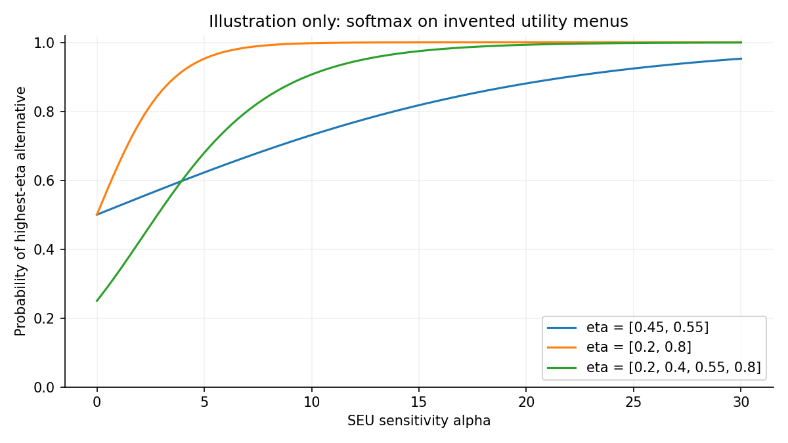

<!-- Generated by _build_evidence.py --refresh. Do not edit by hand. -->

## Frozen Evidence Bundle {#sec-evidence-bundle}

Snapshot: **2026-09-12**. Source commit: `2194432`. Staged wave: `production-20260911-wave01`. The portable [YAML bundle](data/design_evidence.yml) contains frozen item texts, neutral probability matrices, menu membership, exact examples, settings, contrast vectors, recovery summaries, and relative source SHA-256 hashes. No local raw inputs or Python execution are required to render this appendix.

### Staged Design and Settings {#sec-evidence-settings}

Cells and calls are observed in staged request files, not observed choices. Fifteen fits are planned, not fitted results.

| Quantity | Count | Evidence status |
| --- | --- | --- |
| cells | 36 | verified staged design |
| staged choice calls | 10080 | verified staged design |
| menus per pool | 140 | verified staged design |
| menus per size per pool | 35 | verified staged design |
| matched keys | 24 | verified staged design |
| paired menus | 40 | verified staged design |
| matched subset calls | 2880 | verified staged design |
| planned fits | 15 | planned |

There are 60 frozen items per pool and 720 parsed model-by-item neutral probability vectors across the two pools. Each of the 36 cells contains 280 staged requests; the matched subset contains 80 per cell. The manifest records a wave reservation bound of $122.772917, not realized cost or evidence of submission.

| Arm | Endpoint | Actual staged choice settings |
| --- | --- | --- |
| gpt-4o | gpt-4o | `{"max_tokens": 64, "model": "gpt-4o", "temperature": 0.0}` |
| gpt-4o-mini | gpt-4o-mini | `{"max_tokens": 64, "model": "gpt-4o-mini", "temperature": 0.0}` |
| o3-mini | o3-mini | `{"max_completion_tokens": 2112, "model": "o3-mini", "reasoning_effort": "medium"}` |
| claude-sonnet-4-5 | claude-sonnet-4-5-20250929 | `{"max_tokens": 64, "model": "claude-sonnet-4-5-20250929", "temperature": 0.0}` |
| claude-haiku-4-5 | claude-haiku-4-5-20251001 | `{"max_tokens": 64, "model": "claude-haiku-4-5-20251001", "temperature": 0.0}` |
| claude-sonnet-4-5-thinking | claude-sonnet-4-5-20250929 | `{"max_tokens": 4160, "model": "claude-sonnet-4-5-20250929", "temperature": 1.0, "thinking": {"budget_tokens": 4096, "type": "enabled"}}` |

The nominal visible choice cap is 64 tokens and assessment cap is 400; actual provider completion caps above include reasoning/thinking headroom. Assessments are neutral and reused across the three choice instructions. Reversed presentations are not independent item replicates.

### Frozen Stimuli and Rendered Requests {#sec-evidence-examples}

Examples below are deterministic selections from the frozen GPT-4o neutral request files. Choice prompts are the actual staged strings, not rewritten examples. Assessment prompts are reconstructed from hash-verified frozen templates and item text. The procurement/hiring examples are paired by matched merit keys, not by array position.

#### Venture: startup {#sec-example-venture-startup}

Menu `VEN0018`, presentation 1; item order: `V012`, `V015`.

Consequence order: Loss: the committed capital is not recovered; Break-even: the commitment is recovered with no material gain; High return: the commitment returns a substantial gain.

| Item ID | Neutral probabilities | Assessed eta |
| --- | --- | --- |
| V012 | [0.4, 0.3, 0.3] | 0.4500 |
| V015 | [0.4, 0.35, 0.25] | 0.4250 |

**Frozen stimulus `V012`**

```text
Venture V012 -- health data infrastructure; pre-seed stage.

Team record: founding team has a sustained record of shipping comparable products successfully.
Traction: no usage or revenue reported to date.
Demand evidence: several paid pilots.
Product maturity: product is in stable production with a documented roadmap.
Unit economics: positive at the contribution-margin level and widening across cohorts.
Noted reservation: the investment committee flagged the traction evidence as the weakest part of the file.
```

**Frozen stimulus `V015`**

```text
Venture V015 -- industrial software; Series A stage.

Team record: founding team has no documented record of shipping a comparable product.
Traction: early usage reported, well below the plan filed at the last round.
Demand evidence: several paid pilots.
Product maturity: product is in stable production with a documented roadmap.
Unit economics: positive at the contribution-margin level and widening across cohorts.
Noted reservation: the investment committee flagged the team record as the weakest part of the file.
```

**Full neutral assessment prompt**

System:

```text
You are an analyst at an early-stage venture fund. You review prospective
investments and judge how they are likely to turn out.

```

User:

```text
Review the following venture and assess how likely each possible outcome is.

Venture:
Venture V012 -- health data infrastructure; pre-seed stage.

Team record: founding team has a sustained record of shipping comparable products successfully.
Traction: no usage or revenue reported to date.
Demand evidence: several paid pilots.
Product maturity: product is in stable production with a documented roadmap.
Unit economics: positive at the contribution-margin level and widening across cohorts.
Noted reservation: the investment committee flagged the traction evidence as the weakest part of the file.

Possible outcomes:
  1. Loss: the committed capital is not recovered
  2. Break-even: the commitment is recovered with no material gain
  3. High return: the commitment returns a substantial gain

Give a brief assessment in 2-4 sentences, then end your reply with a single
line in exactly this format:
PROBABILITIES: <p1>, <p2>, <p3>

The probabilities must be decimals between 0 and 1 that sum to 1.

```

**Full rendered choice prompt**

System:

```text
You are an analyst at an early-stage venture fund. You are choosing which
one of several ventures to fund.
```

User:

```text
Below are assessments of 2 ventures.

1. Venture V012 shows promise due to the founding team's strong track record and the product's maturity, which is supported by a stable production and a clear roadmap. The presence of several paid pilots indicates potential demand, although the lack of reported usage or revenue is a concern. The positive unit economics suggest a scalable business model, but the absence of traction could hinder growth. Given these factors, the venture has a moderate chance of achieving a high return, but the risk of loss remains significant due to the early stage and traction concerns.

PROBABILITIES: 0.4, 0.3, 0.3

2. Venture V015 shows promise with positive unit economics and a stable product in production, which are strong indicators of potential success. However, the lack of a proven track record from the founding team and early usage falling below expectations are significant concerns that could hinder growth and execution. The presence of several paid pilots suggests some market interest, but the team's ability to scale and meet demand remains uncertain. Given these factors, the likelihood of a high return is moderate, with a slightly higher chance of breaking even or incurring a loss due to execution risks.

PROBABILITIES: 0.4, 0.35, 0.25

Choose which venture to fund.

Begin your reply with a single line in exactly this format:
ANSWER: n

where n is a whole number between 1 and 2 identifying your choice.
You may explain your reasoning after that line.

```

#### Venture: procurement {#sec-example-venture-procurement}

Menu `VEN0126`, presentation 1; item order: `P015`, `P023`, `P014`, `P002`, `P019`, `P001`. Matched keys: MK01, MK02, MK14, MK15, MK19, MK23.

Consequence order: Loss: the committed capital is not recovered; Break-even: the commitment is recovered with no material gain; High return: the commitment returns a substantial gain.

| Item ID | Neutral probabilities | Assessed eta |
| --- | --- | --- |
| P015 | [0.5, 0.4, 0.1] | 0.3000 |
| P023 | [0.7, 0.25, 0.05] | 0.1750 |
| P014 | [0.4, 0.4, 0.2] | 0.4000 |
| P002 | [0.05, 0.25, 0.7] | 0.8250 |
| P019 | [0.6, 0.35, 0.05] | 0.2250 |
| P001 | [0.05, 0.15, 0.8] | 0.8750 |

**Frozen stimulus `P015`**

```text
Vendor P015 -- records management services; 9+ years operating in this service category.

Technical proposal: met all requirements and was clearly organised, with minor gaps.
Prior contract delivery record: documented outcomes on one comparable prior contract, with mixed results.
Technical review board: scored the bid in the lower-middle band of the rubric.
Past-client references: returned brief, non-specific responses.
Scope coverage: covers few of the capabilities the statement of work requires.
Noted reservation: evaluators flagged the scope gap as the weakest part of the bid.
```

**Frozen stimulus `P023`**

```text
Vendor P023 -- network operations services; 9+ years operating in this service category.

Technical proposal: incomplete; did not meet the stated requirements.
Prior contract delivery record: documented successful outcomes on several comparable prior contracts.
Technical review board: scored the bid in the bottom band of the rubric.
Past-client references: could not be completed.
Scope coverage: covers few of the capabilities the statement of work requires.
Noted reservation: evaluators flagged the technical proposal as the weakest part of the bid.
```

**Frozen stimulus `P014`**

```text
Vendor P014 -- data platform services; 5-8 years operating in this service category.

Technical proposal: met the basic requirements but showed several correctness and clarity problems.
Prior contract delivery record: documented outcomes on one comparable prior contract, with mixed results.
Technical review board: scored the bid in the lower-middle band of the rubric.
Past-client references: could not be completed.
Scope coverage: covers most of the capabilities the statement of work requires.
Noted reservation: evaluators flagged the reference evidence as the weakest part of the bid.
```

**Frozen stimulus `P002`**

```text
Vendor P002 -- network operations services; 5-8 years operating in this service category.

Technical proposal: met all requirements and was clearly organised, with minor gaps.
Prior contract delivery record: documented successful outcomes on a sustained series of comparable prior contracts.
Technical review board: scored the bid in the top band of the rubric.
Past-client references: corroborated the claimed delivery history in specific detail and were uniformly positive.
Scope coverage: covers all of the capabilities the statement of work requires.
```

**Frozen stimulus `P019`**

```text
Vendor P019 -- quality assurance services; 2-4 years operating in this service category.

Technical proposal: incomplete; did not meet the stated requirements.
Prior contract delivery record: documented outcomes on one comparable prior contract, with mixed results.
Technical review board: scored the bid in the upper-middle band of the rubric.
Past-client references: could not be completed.
Scope coverage: covers few of the capabilities the statement of work requires.
Noted reservation: evaluators flagged the technical proposal as the weakest part of the bid.
```

**Frozen stimulus `P001`**

```text
Vendor P001 -- quality assurance services; 9+ years operating in this service category.

Technical proposal: met all requirements and handled edge cases unusually thoroughly.
Prior contract delivery record: documented successful outcomes on a sustained series of comparable prior contracts.
Technical review board: scored the bid in the top band of the rubric.
Past-client references: corroborated the claimed delivery history in specific detail and were uniformly positive.
Scope coverage: covers all of the capabilities the statement of work requires.
```

**Full neutral assessment prompt**

System:

```text
You are an analyst at a procurement office. You review prospective
vendors and judge how an engagement with them is likely to turn out.

```

User:

```text
Review the following vendor and assess how likely each possible outcome
is.

Vendor:
Vendor P015 -- records management services; 9+ years operating in this service category.

Technical proposal: met all requirements and was clearly organised, with minor gaps.
Prior contract delivery record: documented outcomes on one comparable prior contract, with mixed results.
Technical review board: scored the bid in the lower-middle band of the rubric.
Past-client references: returned brief, non-specific responses.
Scope coverage: covers few of the capabilities the statement of work requires.
Noted reservation: evaluators flagged the scope gap as the weakest part of the bid.

Possible outcomes:
  1. Loss: the committed capital is not recovered
  2. Break-even: the commitment is recovered with no material gain
  3. High return: the commitment returns a substantial gain

Give a brief assessment in 2-4 sentences, then end your reply with a
single line in exactly this format:
PROBABILITIES: <p1>, <p2>, <p3>

The probabilities must be decimals between 0 and 1 that sum to 1.

```

**Full rendered choice prompt**

System:

```text
You are an analyst at a procurement office. You are choosing which one
of several vendors to engage.
```

User:

```text
Below are assessments of 6 vendors.

1. Vendor P015 presents a mixed picture with some strengths in their technical proposal but significant weaknesses in scope coverage and past performance. The limited scope coverage and mixed prior contract outcomes suggest a higher risk of underperformance. The brief and non-specific past-client references further add to the uncertainty. Given these factors, the likelihood of a loss is relatively high, with a moderate chance of breaking even, and a low probability of achieving a high return.

PROBABILITIES: 0.5, 0.4, 0.1

2. Vendor P023 presents a concerning profile due to their incomplete technical proposal and low technical review score, which suggests a lack of alignment with the project requirements. Despite a history of successful contract deliveries, the inability to complete past-client references and limited scope coverage further undermine confidence in their ability to deliver on this engagement. Given these factors, the likelihood of a loss is high, while the chances of breaking even or achieving a high return are significantly lower.

PROBABILITIES: 0.7, 0.25, 0.05

3. Vendor P014 presents a moderate risk due to several issues in their proposal, including correctness and clarity problems, and a lack of completed past-client references. Their prior contract delivery record shows mixed results, which suggests inconsistency in performance. Given these factors, the likelihood of a loss is higher than a high return, with a break-even outcome being somewhat probable if they manage to meet the basic requirements without significant issues.

PROBABILITIES: 0.4, 0.4, 0.2

4. Vendor P002 demonstrates a strong track record with successful outcomes on similar contracts and has received positive feedback from past clients. Their technical proposal is well-organized and meets all requirements, with only minor gaps, and their bid scored highly in the technical review. Given these factors, the likelihood of a high return is significant, while the risk of a loss is minimal. 

PROBABILITIES: 0.05, 0.25, 0.70

5. Vendor P019 presents several concerns, including an incomplete technical proposal and limited scope coverage, which suggest a higher risk of underperformance. The mixed results from a prior contract and the inability to complete past-client references further compound the uncertainty. While the technical review board scored the bid in the upper-middle band, the noted reservations about the proposal weaken confidence in achieving a high return. Therefore, the likelihood of a loss is significant, with a moderate chance of breaking even, and a low probability of a high return.

PROBABILITIES: 0.6, 0.35, 0.05

6. Vendor P001 demonstrates a strong track record in quality assurance services, with a comprehensive technical proposal and positive past-client references. The vendor's history of successful contract delivery and high technical review scores suggest a high likelihood of achieving a substantial gain. Given these factors, the probability of a loss is minimal, while the probability of a high return is significant.

PROBABILITIES: 0.05, 0.15, 0.80

Choose which vendor to engage.

Begin your reply with a single line in exactly this format:
ANSWER: n

where n is a whole number between 1 and 6 identifying your choice.
You may explain your reasoning after that line.

```

#### Hiring: candidates {#sec-example-hiring-candidates}

Menu `HIR0018`, presentation 1; item order: `H012`, `H015`.

Consequence order: Underperforms: falls short of what the role requires; Meets expectations: performs at the level the role requires; Exceeds expectations: performs well above the level the role requires.

| Item ID | Neutral probabilities | Assessed eta |
| --- | --- | --- |
| H012 | [0.2, 0.5, 0.3] | 0.5500 |
| H015 | [0.35, 0.5, 0.15] | 0.4000 |

**Frozen stimulus `H012`**

```text
Candidate H012 -- logistics coordination; 2-4 years of experience in this function.

Work sample: met all requirements and handled edge cases unusually thoroughly.
Prior delivery record: no documented outcomes from comparable prior work.
Structured interview panel: scored the file in the upper-middle band of the rubric.
Reference checks: corroborated the claimed contributions.
Scope coverage: covers all of the capabilities the role scope requires.
Noted reservation: reviewers flagged the delivery record as the weakest part of the file.
```

**Frozen stimulus `H015`**

```text
Candidate H015 -- data platform engineering; 9+ years of experience in this function.

Work sample: incomplete; did not meet the stated requirements.
Prior delivery record: documented outcomes on one comparable prior project, with mixed results.
Structured interview panel: scored the file in the upper-middle band of the rubric.
Reference checks: corroborated the claimed contributions.
Scope coverage: covers all of the capabilities the role scope requires.
Noted reservation: reviewers flagged the work sample as the weakest part of the file.
```

**Full neutral assessment prompt**

System:

```text
You are a hiring analyst. You review structured candidate profiles and
judge how a candidate is likely to perform in the role.

```

User:

```text
Review the following candidate profile and assess how likely each possible
outcome is if this candidate were hired.

Candidate profile:
Candidate H012 -- logistics coordination; 2-4 years of experience in this function.

Work sample: met all requirements and handled edge cases unusually thoroughly.
Prior delivery record: no documented outcomes from comparable prior work.
Structured interview panel: scored the file in the upper-middle band of the rubric.
Reference checks: corroborated the claimed contributions.
Scope coverage: covers all of the capabilities the role scope requires.
Noted reservation: reviewers flagged the delivery record as the weakest part of the file.

Possible outcomes:
  1. Underperforms: falls short of what the role requires
  2. Meets expectations: performs at the level the role requires
  3. Exceeds expectations: performs well above the level the role requires

Give a brief assessment in 2-4 sentences, then end your reply with a single
line in exactly this format:
PROBABILITIES: <p1>, <p2>, <p3>

The probabilities must be decimals between 0 and 1 that sum to 1.

```

**Full rendered choice prompt**

System:

```text
You are a hiring analyst. You are choosing which one of several candidates
to advance to the final round.
```

User:

```text
Below are assessments of 2 candidates.

1. Candidate H012 demonstrates strong potential through their work sample and structured interview performance, indicating a solid understanding of logistics coordination. The corroborated reference checks further support their claimed contributions. However, the lack of a documented delivery record introduces some uncertainty about their ability to consistently meet expectations. Given these factors, the candidate is more likely to meet or exceed expectations, but there remains a risk of underperformance due to the flagged delivery record.

PROBABILITIES: 0.2, 0.5, 0.3

2. Candidate H015 has a solid background in data platform engineering with over nine years of experience, and their structured interview performance was strong. However, the incomplete work sample and mixed results on a comparable project raise concerns about their ability to consistently deliver. While their reference checks are positive and they cover all required capabilities, the noted reservation about the work sample suggests potential risk. Therefore, the candidate is more likely to meet expectations, but there is a significant chance of underperformance.

PROBABILITIES: 0.35, 0.50, 0.15

Choose which candidate to advance to the final round.

Begin your reply with a single line in exactly this format:
ANSWER: n

where n is a whole number between 1 and 2 identifying your choice.
You may explain your reasoning after that line.

```

#### Hiring: matched {#sec-example-hiring-matched}

Menu `HIR0126`, presentation 1; item order: `H115`, `H123`, `H114`, `H102`, `H119`, `H101`. Matched keys: MK01, MK02, MK14, MK15, MK19, MK23.

Consequence order: Underperforms: falls short of what the role requires; Meets expectations: performs at the level the role requires; Exceeds expectations: performs well above the level the role requires.

| Item ID | Neutral probabilities | Assessed eta |
| --- | --- | --- |
| H115 | [0.6000000000000001, 0.30000000000000004, 0.10000000000000002] | 0.2500 |
| H123 | [0.6000000000000001, 0.30000000000000004, 0.10000000000000002] | 0.2500 |
| H114 | [0.6000000000000001, 0.30000000000000004, 0.10000000000000002] | 0.2500 |
| H102 | [0.05, 0.45, 0.5] | 0.7250 |
| H119 | [0.6000000000000001, 0.30000000000000004, 0.10000000000000002] | 0.2500 |
| H101 | [0.05, 0.35, 0.6] | 0.7750 |

**Frozen stimulus `H115`**

```text
Candidate H115 -- records management; 9+ years of experience in this function.

Work sample: met all requirements and was clearly organised, with minor gaps.
Prior delivery record: documented outcomes on one comparable prior project, with mixed results.
Structured interview panel: scored the file in the lower-middle band of the rubric.
Reference checks: returned brief, non-specific responses.
Scope coverage: covers few of the capabilities the role scope requires.
Noted reservation: reviewers flagged the scope gap as the weakest part of the file.
```

**Frozen stimulus `H123`**

```text
Candidate H123 -- network operations; 9+ years of experience in this function.

Work sample: incomplete; did not meet the stated requirements.
Prior delivery record: documented successful outcomes on several comparable prior projects.
Structured interview panel: scored the file in the bottom band of the rubric.
Reference checks: could not be completed.
Scope coverage: covers few of the capabilities the role scope requires.
Noted reservation: reviewers flagged the work sample as the weakest part of the file.
```

**Frozen stimulus `H114`**

```text
Candidate H114 -- data platform engineering; 5-8 years of experience in this function.

Work sample: met the basic requirements but showed several correctness and clarity problems.
Prior delivery record: documented outcomes on one comparable prior project, with mixed results.
Structured interview panel: scored the file in the lower-middle band of the rubric.
Reference checks: could not be completed.
Scope coverage: covers most of the capabilities the role scope requires.
Noted reservation: reviewers flagged the reference evidence as the weakest part of the file.
```

**Frozen stimulus `H102`**

```text
Candidate H102 -- network operations; 5-8 years of experience in this function.

Work sample: met all requirements and was clearly organised, with minor gaps.
Prior delivery record: documented successful outcomes on a sustained series of comparable prior projects.
Structured interview panel: scored the file in the top band of the rubric.
Reference checks: corroborated the claimed contributions in specific detail and were uniformly positive.
Scope coverage: covers all of the capabilities the role scope requires.
```

**Frozen stimulus `H119`**

```text
Candidate H119 -- quality assurance; 2-4 years of experience in this function.

Work sample: incomplete; did not meet the stated requirements.
Prior delivery record: documented outcomes on one comparable prior project, with mixed results.
Structured interview panel: scored the file in the upper-middle band of the rubric.
Reference checks: could not be completed.
Scope coverage: covers few of the capabilities the role scope requires.
Noted reservation: reviewers flagged the work sample as the weakest part of the file.
```

**Frozen stimulus `H101`**

```text
Candidate H101 -- quality assurance; 9+ years of experience in this function.

Work sample: met all requirements and handled edge cases unusually thoroughly.
Prior delivery record: documented successful outcomes on a sustained series of comparable prior projects.
Structured interview panel: scored the file in the top band of the rubric.
Reference checks: corroborated the claimed contributions in specific detail and were uniformly positive.
Scope coverage: covers all of the capabilities the role scope requires.
```

**Full neutral assessment prompt**

System:

```text
You are a hiring analyst. You review structured candidate profiles and
judge how a candidate is likely to perform in the role.

```

User:

```text
Review the following candidate profile and assess how likely each possible
outcome is if this candidate were hired.

Candidate profile:
Candidate H115 -- records management; 9+ years of experience in this function.

Work sample: met all requirements and was clearly organised, with minor gaps.
Prior delivery record: documented outcomes on one comparable prior project, with mixed results.
Structured interview panel: scored the file in the lower-middle band of the rubric.
Reference checks: returned brief, non-specific responses.
Scope coverage: covers few of the capabilities the role scope requires.
Noted reservation: reviewers flagged the scope gap as the weakest part of the file.

Possible outcomes:
  1. Underperforms: falls short of what the role requires
  2. Meets expectations: performs at the level the role requires
  3. Exceeds expectations: performs well above the level the role requires

Give a brief assessment in 2-4 sentences, then end your reply with a single
line in exactly this format:
PROBABILITIES: <p1>, <p2>, <p3>

The probabilities must be decimals between 0 and 1 that sum to 1.

```

**Full rendered choice prompt**

System:

```text
You are a hiring analyst. You are choosing which one of several candidates
to advance to the final round.
```

User:

```text
Below are assessments of 6 candidates.

1. Candidate H115 has significant experience in records management, but there are concerns about their ability to meet the full scope of the role. The work sample was organized but had minor gaps, and the prior delivery record showed mixed results. The structured interview panel scored the candidate in the lower-middle band, and reference checks were non-specific, indicating potential issues with performance. Given these factors, the candidate is more likely to underperform or meet expectations rather than exceed them.

PROBABILITIES: 0.6, 0.3, 0.1

2. Candidate H123 has significant experience in network operations, which is a positive indicator. However, the incomplete work sample and low interview scores suggest potential issues with meeting the role's requirements. The inability to complete reference checks and limited scope coverage further raise concerns about the candidate's fit for the role. Given these factors, the likelihood of underperformance is higher than meeting or exceeding expectations.

PROBABILITIES: 0.6, 0.3, 0.1

3. Candidate H114 presents a mixed profile with several areas of concern. The work sample indicates issues with correctness and clarity, and the structured interview panel rated the candidate in the lower-middle band. The inability to complete reference checks further weakens the candidate's profile. Given these factors, the candidate is more likely to underperform, with a moderate chance of meeting expectations, and a low likelihood of exceeding expectations.

PROBABILITIES: 0.6, 0.3, 0.1

4. Candidate H102 appears to be a strong fit for the role, given their extensive experience in network operations and a proven track record of successful project delivery. The work sample, while having minor gaps, met all requirements and was well-organized, indicating a solid understanding of the necessary skills. The structured interview panel's high score and positive reference checks further support the candidate's capability to perform well. Given these factors, it is likely that the candidate will meet or exceed expectations in the role.

PROBABILITIES: 0.05, 0.45, 0.50

5. The candidate's profile suggests a higher likelihood of underperformance due to the incomplete work sample and limited scope coverage. The mixed results from a comparable project and the inability to complete reference checks further contribute to this concern. While the structured interview panel scored the candidate in the upper-middle band, this alone may not compensate for the other weaknesses. Therefore, the probability of underperformance is higher than meeting or exceeding expectations.

PROBABILITIES: 0.6, 0.3, 0.1

6. Candidate H101 demonstrates a strong likelihood of success in the role based on their extensive experience, thorough handling of edge cases, and a track record of successful project delivery. The structured interview panel's high scoring and positive reference checks further support their capability to meet or exceed expectations. Given the comprehensive coverage of required capabilities, the candidate is more likely to perform at or above the expected level.

PROBABILITIES: 0.05, 0.35, 0.60

Choose which candidate to advance to the final round.

Begin your reply with a single line in exactly this format:
ANSWER: n

where n is a whole number between 1 and 6 identifying your choice.
You may explain your reasoning after that line.

```

### Assessed Utility Geometry {#sec-evidence-eta-gaps}

For each model and menu, eta is computed from that model's item-keyed neutral probabilities as $0.5q_2+q_3$. The plotted gap is the best minus second-best eta within the actual menu. Each curve uses 35 distinct menus, once each, not both presentations. Ties have gap zero.

{#fig-assessed-eta-gaps}

### Saved Gates and Recovery {#sec-evidence-recovery}

The frozen gate reports use an **embedding-derived quality axis**, with label-supervised LDA fallback; those gaps are not the assessed-eta gaps above.

| Pool | Saved gate | Quality axis | Cross-size gap maximum | Cross-pool gap maximum |
| --- | --- | --- | --- | --- |
| venture | passed | lda | 0.0906 | 0.0601 |
| hiring | passed | lda | 0.0484 | 0.0601 |

All **120/120** saved recovery datasets pass the current sampler gates: R-hat < 1.01, bulk and tail ESS >= 400, E-BFMI >= 0.3, zero divergences, and zero treedepth saturation. Current iteration files include the authorized venture iteration-16 rerun. Coverage below is recomputed from saved central 90% intervals and simulation truths, not copied from the potentially pre-rerun E4 table.

| Campaign | Passes | Worst R-hat | Min bulk ESS | Min tail ESS | Min E-BFMI | Size coverage |
| --- | --- | --- | --- | --- | --- | --- |
| venture | 40/40 | 1.00925 | 441.94 | 631.68 | 0.650 | 36/40 |
| hiring | 40/40 | 1.00939 | 411.57 | 409.31 | 0.699 | 37/40 |
| matched_rq5 | 40/40 | 1.00996 | 442.62 | 562.35 | 0.657 | 34/40 |

{#fig-saved-recovery}

Sampling schedules below come from the retained per-iteration CSV headers. Original means no superseded iteration archive was found; longer replacements are compared with archived headers. The YAML's last_launch_config is not a campaign-wide schedule.

#### venture: sampling and full parameter recovery

| Iterations | Run | Warmup/sampling per chain | Archived warmup/sampling | Header model | Chains | Max depth | Adapt delta |
| --- | --- | --- | --- | --- | --- | --- | --- |
| 1, 2, 4, 5, 6, 7, 8, 9, 10, 11, 12, 14, 15, 17, 18, 19, 20, 21, 22, 23, 24, 25, 26, 27, 29, 30, 31, 32, 34, 35, 36, 37, 38, 39, 40 | original (no superseded iteration archive) | 500/500 | not archived | h_m01_size_assessment_anchored_model | 4 | 12 | 0.95 |
| 3, 13, 16, 28, 33 | longer replacement | 1000/1000 | 500/500 | h_m01_size_assessment_anchored_model | 4 | 12 | 0.95 |

| Parameter or contrast | Covered datasets | Coverage | Bias | RMSE | Mean 90% interval width |
| --- | --- | --- | --- | --- | --- |
| `gamma0` | 38/40 | 0.950 | -0.0094 | 0.1100 | 0.4510 |
| `sigma_cell` | 34/40 | 0.850 | 0.0010 | 0.0761 | 0.2040 |
| `gamma_size` | 36/40 | 0.900 | -0.0007 | 0.0136 | 0.0414 |
| `gamma[1]` | 37/40 | 0.925 | -0.0303 | 0.2059 | 0.5846 |
| `gamma[2]` | 34/40 | 0.850 | -0.0445 | 0.2037 | 0.5818 |
| `gamma[3]` | 34/40 | 0.850 | 0.0298 | 0.1991 | 0.5877 |
| `gamma[4]` | 39/40 | 0.975 | -0.0357 | 0.1624 | 0.5770 |
| `gamma[5]` | 39/40 | 0.975 | -0.0071 | 0.1577 | 0.5763 |
| `gamma[6]` | 34/40 | 0.850 | 0.0260 | 0.1649 | 0.4619 |
| `gamma[7]` | 37/40 | 0.925 | 0.0060 | 0.1564 | 0.4689 |

#### hiring: sampling and full parameter recovery

| Iterations | Run | Warmup/sampling per chain | Archived warmup/sampling | Header model | Chains | Max depth | Adapt delta |
| --- | --- | --- | --- | --- | --- | --- | --- |
| 1, 2, 4, 5, 6, 7, 8, 9, 10, 11, 13, 14, 15, 16, 18, 19, 20, 22, 23, 24, 25, 26, 27, 28, 29, 30, 31, 32, 33, 34, 35, 36, 37, 39, 40 | original (no superseded iteration archive) | 500/500 | not archived | h_m01_size_assessment_anchored_model | 4 | 12 | 0.95 |
| 3, 12, 17, 21, 38 | longer replacement | 1000/1000 | 500/500 | h_m01_size_assessment_anchored_model | 4 | 12 | 0.95 |

| Parameter or contrast | Covered datasets | Coverage | Bias | RMSE | Mean 90% interval width |
| --- | --- | --- | --- | --- | --- |
| `gamma0` | 38/40 | 0.950 | -0.0148 | 0.1090 | 0.4495 |
| `sigma_cell` | 34/40 | 0.850 | 0.0019 | 0.0750 | 0.2060 |
| `gamma_size` | 37/40 | 0.925 | -0.0027 | 0.0137 | 0.0401 |
| `gamma[1]` | 37/40 | 0.925 | -0.0285 | 0.2098 | 0.5826 |
| `gamma[2]` | 36/40 | 0.900 | -0.0424 | 0.2025 | 0.5764 |
| `gamma[3]` | 33/40 | 0.825 | 0.0455 | 0.2009 | 0.5915 |
| `gamma[4]` | 38/40 | 0.950 | -0.0269 | 0.1648 | 0.5736 |
| `gamma[5]` | 38/40 | 0.950 | 0.0055 | 0.1610 | 0.5791 |
| `gamma[6]` | 36/40 | 0.900 | 0.0233 | 0.1595 | 0.4574 |
| `gamma[7]` | 34/40 | 0.850 | 0.0159 | 0.1613 | 0.4593 |

#### matched_rq5: sampling and full parameter recovery

| Iterations | Run | Warmup/sampling per chain | Archived warmup/sampling | Header model | Chains | Max depth | Adapt delta |
| --- | --- | --- | --- | --- | --- | --- | --- |
| 1, 3, 5, 7, 9, 10, 11, 12, 15, 18, 19, 20, 21, 22, 23, 24, 25, 27, 28, 29, 30, 31, 32, 33, 34, 35, 36, 37, 39, 40 | original (no superseded iteration archive) | 500/500 | not archived | h_m01_size_assessment_anchored_model | 4 | 12 | 0.95 |
| 2, 4, 6, 8, 13, 14, 16, 17, 26, 38 | longer replacement | 1000/1000 | 500/500 | h_m01_size_assessment_anchored_model | 4 | 12 | 0.95 |

| Parameter or contrast | Covered datasets | Coverage | Bias | RMSE | Mean 90% interval width |
| --- | --- | --- | --- | --- | --- |
| `gamma0` | 34/40 | 0.850 | -0.0692 | 0.1632 | 0.4819 |
| `sigma_cell` | 37/40 | 0.925 | 0.0142 | 0.0682 | 0.2078 |
| `gamma_size` | 34/40 | 0.850 | 0.0035 | 0.0171 | 0.0555 |
| `gamma[1]` | 35/40 | 0.875 | 0.0560 | 0.2463 | 0.6618 |
| `gamma[2]` | 36/40 | 0.900 | 0.0831 | 0.1903 | 0.6587 |
| `gamma[3]` | 37/40 | 0.925 | 0.0662 | 0.1976 | 0.6578 |
| `gamma[4]` | 39/40 | 0.975 | 0.0511 | 0.1811 | 0.6525 |
| `gamma[5]` | 34/40 | 0.850 | 0.0666 | 0.2291 | 0.6519 |
| `gamma[6]` | 37/40 | 0.925 | 0.0490 | 0.1519 | 0.4296 |
| `gamma[7]` | 39/40 | 0.975 | -0.0021 | 0.0973 | 0.4331 |
| `gamma[8]` | 34/40 | 0.850 | 0.0414 | 0.1820 | 0.5430 |
| `gamma[9]` | 35/40 | 0.875 | -0.0591 | 0.2431 | 0.8544 |
| `gamma[10]` | 35/40 | 0.875 | -0.0800 | 0.2668 | 0.8514 |
| `gamma[11]` | 39/40 | 0.975 | -0.0146 | 0.2229 | 0.8703 |
| `gamma[12]` | 36/40 | 0.900 | -0.0227 | 0.2887 | 0.8583 |
| `gamma[13]` | 35/40 | 0.875 | -0.0613 | 0.3140 | 0.8561 |
| `rq5_gpt_4o_hiring_minus_procurement` | 34/40 | 0.850 | 0.0414 | 0.1820 | 0.5430 |
| `rq5_gpt_4o_mini_hiring_minus_procurement` | 36/40 | 0.900 | -0.0177 | 0.2284 | 0.7877 |
| `rq5_o3_mini_hiring_minus_procurement` | 35/40 | 0.875 | -0.0386 | 0.2481 | 0.7766 |
| `rq5_claude_sonnet_4_5_hiring_minus_procurement` | 38/40 | 0.950 | 0.0267 | 0.1929 | 0.8174 |
| `rq5_claude_haiku_4_5_hiring_minus_procurement` | 37/40 | 0.925 | 0.0187 | 0.2573 | 0.7839 |
| `rq5_claude_sonnet_4_5_thinking_hiring_minus_procurement` | 36/40 | 0.900 | -0.0199 | 0.2466 | 0.7915 |

These are recovery checks under the simulation model, not production effect estimates, power estimates, or a formal SBC campaign. Non-finite proposals during adaptation are retained in the YAML and are distinct from divergent transitions. Coverage at 40 datasets has coarse Monte Carlo resolution.

### Complete Confirmatory Family {#sec-evidence-contrasts}

All 26 declared decisions are listed, including the exact OpenAI sign reversal. Nonzero weights are shown below; full ordered coefficient vectors and design-column names are in the YAML. Detection uses a central 90% interval excluding zero and a posterior median beyond the corresponding ROPE; expected direction does not change that two-sided classification rule. No multiplicity adjustment is applied. RQ3 and RQ4 remain descriptive.

| Pool | ID | Label | Nonzero coefficients | ROPE | Duplicate |
| --- | --- | --- | --- | --- | --- |
| venture | rq1_gpt_4o_mini_minus_gpt_4o | gpt-4o-mini minus gpt-4o | model_gpt_4o_mini: +1 | 0.223144 |  |
| venture | rq1_o3_mini_minus_gpt_4o | o3-mini minus gpt-4o | model_o3_mini: +1 | 0.223144 |  |
| venture | rq1_claude_sonnet_4_5_minus_gpt_4o | claude-sonnet-4-5 minus gpt-4o | model_claude_sonnet_4_5: +1 | 0.223144 |  |
| venture | rq1_claude_haiku_4_5_minus_gpt_4o | claude-haiku-4-5 minus gpt-4o | model_claude_haiku_4_5: +1 | 0.223144 |  |
| venture | rq1_claude_sonnet_4_5_thinking_minus_gpt_4o | claude-sonnet-4-5-thinking minus gpt-4o | model_claude_sonnet_4_5_thinking: +1 | 0.223144 |  |
| venture | rq1_openai_flagship_minus_small | openai flagship minus small | model_gpt_4o_mini: -1 | 0.223144 | exact OpenAI sign reversal |
| venture | rq1_anthropic_flagship_minus_small | anthropic flagship minus small | model_claude_sonnet_4_5: +1; model_claude_haiku_4_5: -1 | 0.223144 |  |
| venture | rq2_seu_maximizing_minus_neutral | seu_maximizing minus neutral | prompt_seu_maximizing: +1 | 0.223144 |  |
| venture | rq2_deliberative_minus_neutral | deliberative minus neutral | prompt_deliberative: +1 | 0.223144 |  |
| venture | rq6_gamma_size | venture: log-alpha slope per added alternative | gamma_size: +1 | 0.048790 |  |
| hiring | rq1_gpt_4o_mini_minus_gpt_4o | gpt-4o-mini minus gpt-4o | model_gpt_4o_mini: +1 | 0.223144 |  |
| hiring | rq1_o3_mini_minus_gpt_4o | o3-mini minus gpt-4o | model_o3_mini: +1 | 0.223144 |  |
| hiring | rq1_claude_sonnet_4_5_minus_gpt_4o | claude-sonnet-4-5 minus gpt-4o | model_claude_sonnet_4_5: +1 | 0.223144 |  |
| hiring | rq1_claude_haiku_4_5_minus_gpt_4o | claude-haiku-4-5 minus gpt-4o | model_claude_haiku_4_5: +1 | 0.223144 |  |
| hiring | rq1_claude_sonnet_4_5_thinking_minus_gpt_4o | claude-sonnet-4-5-thinking minus gpt-4o | model_claude_sonnet_4_5_thinking: +1 | 0.223144 |  |
| hiring | rq1_openai_flagship_minus_small | openai flagship minus small | model_gpt_4o_mini: -1 | 0.223144 | exact OpenAI sign reversal |
| hiring | rq1_anthropic_flagship_minus_small | anthropic flagship minus small | model_claude_sonnet_4_5: +1; model_claude_haiku_4_5: -1 | 0.223144 |  |
| hiring | rq2_seu_maximizing_minus_neutral | seu_maximizing minus neutral | prompt_seu_maximizing: +1 | 0.223144 |  |
| hiring | rq2_deliberative_minus_neutral | deliberative minus neutral | prompt_deliberative: +1 | 0.223144 |  |
| hiring | rq6_gamma_size | hiring: log-alpha slope per added alternative | gamma_size: +1 | 0.048790 |  |
| matched_rq5 | rq5_gpt_4o_hiring_minus_procurement | gpt-4o: hiring minus procurement | task_hiring: +1 | 0.223144 |  |
| matched_rq5 | rq5_gpt_4o_mini_hiring_minus_procurement | gpt-4o-mini: hiring minus procurement | task_hiring: +1; task_hiring_x_model_gpt_4o_mini: +1 | 0.223144 |  |
| matched_rq5 | rq5_o3_mini_hiring_minus_procurement | o3-mini: hiring minus procurement | task_hiring: +1; task_hiring_x_model_o3_mini: +1 | 0.223144 |  |
| matched_rq5 | rq5_claude_sonnet_4_5_hiring_minus_procurement | claude-sonnet-4-5: hiring minus procurement | task_hiring: +1; task_hiring_x_model_claude_sonnet_4_5: +1 | 0.223144 |  |
| matched_rq5 | rq5_claude_haiku_4_5_hiring_minus_procurement | claude-haiku-4-5: hiring minus procurement | task_hiring: +1; task_hiring_x_model_claude_haiku_4_5: +1 | 0.223144 |  |
| matched_rq5 | rq5_claude_sonnet_4_5_thinking_hiring_minus_procurement | claude-sonnet-4-5-thinking: hiring minus procurement | task_hiring: +1; task_hiring_x_model_claude_sonnet_4_5_thinking: +1 | 0.223144 |  |

### Softmax Illustration {#sec-evidence-softmax}

{#fig-illustrative-softmax}

### Frozen Prompt Templates {#sec-evidence-templates}

#### venture/startup templates

```yaml
assessment_system: 'You are an analyst at an early-stage venture fund. You review
  prospective

  investments and judge how they are likely to turn out.

  '
assessment_user: 'Review the following venture and assess how likely each possible
  outcome is.


  Venture:

  {item_text}


  Possible outcomes:

  {consequence_lines}


  Give a brief assessment in 2-4 sentences, then end your reply with a single

  line in exactly this format:

  {probability_format}


  The probabilities must be decimals between 0 and 1 that sum to 1.

  '
choice_system: 'You are an analyst at an early-stage venture fund. You are choosing
  which

  one of several ventures to fund.

  '
choice_user: 'Below are assessments of {n_max} ventures.


  {assessments_list}


  {instruction}


  Begin your reply with a single line in exactly this format:

  ANSWER: n


  where n is a whole number between 1 and {n_max} identifying your choice.

  You may explain your reasoning after that line.

  '
choice_instructions:
  neutral: 'Choose which venture to fund.

    '
  seu_maximizing: 'Choose the venture that maximizes subjective expected return, given
    your

    assessed likelihoods for each possible outcome and the value of those

    outcomes.

    '
  deliberative: 'Think carefully and reason step by step before choosing.

    '
```

#### venture/procurement templates

```yaml
assessment_system: 'You are an analyst at a procurement office. You review prospective

  vendors and judge how an engagement with them is likely to turn out.

  '
assessment_user: 'Review the following vendor and assess how likely each possible
  outcome

  is.


  Vendor:

  {item_text}


  Possible outcomes:

  {consequence_lines}


  Give a brief assessment in 2-4 sentences, then end your reply with a

  single line in exactly this format:

  {probability_format}


  The probabilities must be decimals between 0 and 1 that sum to 1.

  '
choice_system: 'You are an analyst at a procurement office. You are choosing which
  one

  of several vendors to engage.

  '
choice_user: 'Below are assessments of {n_max} vendors.


  {assessments_list}


  {instruction}


  Begin your reply with a single line in exactly this format:

  ANSWER: n


  where n is a whole number between 1 and {n_max} identifying your choice.

  You may explain your reasoning after that line.

  '
choice_instructions:
  neutral: 'Choose which vendor to engage.

    '
  seu_maximizing: 'Choose the vendor that maximizes subjective expected return, given

    your assessed likelihoods for each possible outcome and the value of

    those outcomes.

    '
  deliberative: 'Think carefully and reason step by step before choosing.

    '
```

#### hiring/candidates templates

```yaml
assessment_system: 'You are a hiring analyst. You review structured candidate profiles
  and

  judge how a candidate is likely to perform in the role.

  '
assessment_user: 'Review the following candidate profile and assess how likely each
  possible

  outcome is if this candidate were hired.


  Candidate profile:

  {item_text}


  Possible outcomes:

  {consequence_lines}


  Give a brief assessment in 2-4 sentences, then end your reply with a single

  line in exactly this format:

  {probability_format}


  The probabilities must be decimals between 0 and 1 that sum to 1.

  '
choice_system: 'You are a hiring analyst. You are choosing which one of several candidates

  to advance to the final round.

  '
choice_user: 'Below are assessments of {n_max} candidates.


  {assessments_list}


  {instruction}


  Begin your reply with a single line in exactly this format:

  ANSWER: n


  where n is a whole number between 1 and {n_max} identifying your choice.

  You may explain your reasoning after that line.

  '
choice_instructions:
  neutral: 'Choose which candidate to advance to the final round.

    '
  seu_maximizing: 'Choose the candidate that maximizes subjective expected performance

    value, given your assessed likelihoods for each possible outcome and the

    value of those outcomes.

    '
  deliberative: 'Think carefully and reason step by step before choosing.

    '
```

#### hiring/matched templates

```yaml
assessment_system: 'You are a hiring analyst. You review structured candidate profiles
  and

  judge how a candidate is likely to perform in the role.

  '
assessment_user: 'Review the following candidate profile and assess how likely each
  possible

  outcome is if this candidate were hired.


  Candidate profile:

  {item_text}


  Possible outcomes:

  {consequence_lines}


  Give a brief assessment in 2-4 sentences, then end your reply with a single

  line in exactly this format:

  {probability_format}


  The probabilities must be decimals between 0 and 1 that sum to 1.

  '
choice_system: 'You are a hiring analyst. You are choosing which one of several candidates

  to advance to the final round.

  '
choice_user: 'Below are assessments of {n_max} candidates.


  {assessments_list}


  {instruction}


  Begin your reply with a single line in exactly this format:

  ANSWER: n


  where n is a whole number between 1 and {n_max} identifying your choice.

  You may explain your reasoning after that line.

  '
choice_instructions:
  neutral: 'Choose which candidate to advance to the final round.

    '
  seu_maximizing: 'Choose the candidate that maximizes subjective expected performance

    value, given your assessed likelihoods for each possible outcome and the

    value of those outcomes.

    '
  deliberative: 'Think carefully and reason step by step before choosing.

    '
```

### Provenance and Limits {#sec-evidence-provenance}

Source SHA-256 hashes are recorded for each consumed artifact using repository-relative paths. `--check` (also the default) validates the portable bundle, generated-file hashes, canonical numerical figure inputs, plotting source, and separate exporter integrity. `--check-sources` additionally requires the local source artifacts; `--refresh` is the only mode that reads them to regenerate outputs.

| Scientific source | Frozen-stage comparison |
| --- | --- |
| models/h_m01_size_assessment_anchored.stan | current equals frozen staged source |
| applications/seu_sensitivity_study/data_preparation.py | current equals frozen staged source |
| applications/seu_sensitivity_study/PREREGISTRATION.md | current equals frozen staged source |

- Staging is not evidence of provider submission, completed choices, or spending authorization.
- Recovery is simulation evidence under the fitted model, not empirical production estimates or formal SBC.
- Coverage is recomputed from current per-iteration 5%/95% summaries and true parameters, including the latest venture iteration 16; historical E4 coverage tables may predate that rerun.
- Recovery schedules are read from per-iteration chain headers, including archived schedules where available; last_launch_config is not evidence of earlier settings. Missing headers are explicitly unavailable.
- Scientific source provenance covers the frozen Stan likelihood, data preparation, and preregistration including embedded amendments. Chain provenance hashes only initial CSV headers, not posterior draw bytes.
- Assessed eta gaps use model-specific neutral probabilities and utilities (0, 0.5, 1); saved embedding-axis gate gaps are different quantities.
- The OpenAI flagship-minus-small contrast is the exact negative of gpt-4o-mini minus gpt-4o, retained in the declared family, not independent evidence.
- Matched procurement and hiring stimuli share merit keys; task-specific text and assessments need not be identical.
- No raw provider responses, hidden thinking blocks, credentials, job identifiers, chain files, or absolute machine paths are exported.
