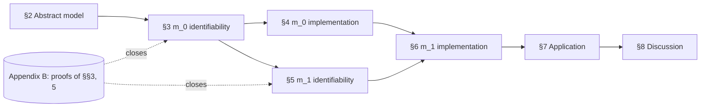

# Plan for the Methodological Paper on SEU Sensitivity

*This document is a **plan** for writing the paper. It has two parts: **Part I** records the writing strategy and the decisions that govern how claims are framed; **Part II** is the section-by-section outline. The outline is one part of the plan, not the whole of it.*

> **SUPERSEDED (2026-06-23) — weak-identifiability / Fisher apparatus removed.**
> The Fisher-information "weak (practical) identifiability" machinery described
> below (Proposition 3.2 / Appendix B.2, the η-Jacobian Fisher block, condition
> number / Schur-complement / near-flat-direction analysis, the `b2_fisher_block`
> spike + Fig B.2, and the IV/GMM "weak identification" demarcation) has been
> **removed from the paper**. The substantive claim is retained but re-grounded
> on the Bayesian workflow: uncertain choices leave (β, δ) *weakly informed*, as
> shown directly by parameter recovery (wide marginal CIs + a negative β–δ error
> correlation; Report 4 / claims-ledger C4). "Weak identifiability" / "ridge"
> wording is replaced by Bayesian-native phrasing throughout, and the §3.5
> α-separation is now stated as an empirical observation, not a mechanism. The
> b2 artifacts are archived under `local/archive/b2_fisher_weak_id_removed_20260623/`.
> Read the passages below as historical record; they no longer describe the paper.

---

# Part I — Writing strategy and key decisions

## Framing spine (the paper's one-sentence thesis)

In `m_0`, α is identifiable from uncertain choices while (β, δ) are only **weakly identifiable** — the likelihood is essentially flat along a (β, δ) ridge at realistic sample sizes; in `m_1`, δ becomes identifiable in principle (hence estimable in the limit) via the β-free risky block, but at realistic sample sizes the practical payoff is negligible for **both** parameters — δ's matched-count CI tightens by under 1%, and the β-free risky block confers **no per-choice advantage for α** (a pre-registered n = 100 re-run overturned the pilot's apparent α gain): finite-sample α precision tracks data *quantity*, not the *type* of choice. This in-principle-identification-vs-finite-n-estimability gap *is* the methodological payload; the fact that **marginal SBC passes despite the joint (β, δ) weak identification** is a second such lesson; and a **2×2 illustrative application** — GPT-4o × Claude 3.5 Sonnet crossed with insurance triage × Ellsberg-style urns — demonstrates that the full workflow runs end-to-end on real LLM choice data and that the framework can detect a structured comparative effect when one is present (GPT-4o monotonic α–temperature decline in both tasks) and decline to support one when it is not (Claude in either task). Every empirical claim in §4 and §6 must trace to the foundational reports — chiefly `04_parameter_recovery.qmd`, `06_sbc_validation.qmd`, and `14_does_m1_identify_delta.qmd` (the last as re-estimated at n = 100, `spikes/report14_rerun_results.json`); every empirical claim in §7 must trace to the application reports — `temperature_study/01_initial_study.qmd`, `claude_insurance_study/01_claude_insurance_study.qmd`, `gpt4o_ellsberg_study/01_gpt4o_ellsberg_study.qmd`, `ellsberg_study/01_ellsberg_study.qmd`, and `factorial_synthesis/01_factorial_synthesis.qmd`.

## Honest-reporting commitments

- **Identifiability vs. estimability.** Distinguish identifiability (a likelihood property, which implies the parameter is *estimable in the limit*) from *precise estimability at realistic, finite sample sizes* (a property of the posterior given a design). Use the phrasing "identifiable (hence estimable in the limit) ≠ precisely estimable at realistic sample sizes." Never the bare "identifiable ≠ estimable."
- **Strict vs. weak (practical) non-identifiability.** In `m_0` we do **not** claim a strict (β, δ) gauge group — i.e., a family of nontrivial transformations that leave every choice probability literally fixed. The foundational reports document a *ridge of low Fisher information* in the joint (β, δ) posterior: a near-flat direction along which the likelihood barely discriminates at realistic n. The paper's term of art for this is **weak (practical) identifiability** (or "ridge identifiability"); reserve "non-identifiable" for the strict, likelihood-flat case. The α/δ contrast in §6 illustrates the bridge between weak identifiability and the failure of precise finite-sample estimability. **Demarcation from the econometric term of art.** Our "weak (practical) identifiability" is *not* the IV/GMM "weak identification" of Stock–Wright–Yogo / Andrews–Cheng, where weak instruments correlate weakly with endogenous regressors and induce nonstandard asymptotics. Both reflect low information curvature, but the constructions differ. Introduce this demarcation explicitly in §2.7/§3.4 (one sentence) so a statistics/econometrics-trained reader does not misread; prefer "ridge identifiability" where ambiguity would otherwise arise.
- **The δ result, reported honestly.** Report 14's matched-design study, re-estimated at **n = 100** (`spikes/report14_rerun_results.json`), found a δ CI-width reduction of only ≈ **0.8%** at equal total choice count (B vs C) — paired-iteration median, bootstrap 90% CI [0.6, 1.2], narrower in 72% of iterations, Wilcoxon signed-rank p ≈ 1.2e-6 — and **no** change in δ RMSE (0.3%, 90% CI [−4.0, +4.5]). The CI-width effect is statistically real but practically negligible, and **even smaller than the 30-iteration pilot's ≈ 2%**. Always report it as a paired-iteration median with a bootstrap 90% CI, never a point estimate. Do **not** promise a "material" δ gain. (The pre-publication n ≥ 100 re-run is **done** — it superseded the pilot; the pilot's ≈ 2% figure must not be cited.)
- **Lead the `m_1` story with the in-principle-vs-finite-n lesson, not an α win.** The 30-iteration pilot's headline — that adding risky choices sharpens α by ≈ 15% at matched choice count — **did not replicate** at n = 100: the matched B→C α-RMSE change is null (−8.1%, bootstrap 90% CI [−22.0, +6.8]). The informative control is A→B, where doubling the *uncertain* block alone cuts α RMSE ≈ 27% (90% CI [+15.0, +38.5]). So the β-free risky block confers **no per-choice α advantage**; finite-sample α precision tracks data *quantity*, not choice *type*. Structure §5–6 around the corrected arc: in-principle identification (§5) does not predict finite-n estimability (§6) — for δ it buys almost no precision, and for α it does not tell you where precision comes from (quantity, not type). Report all percentages as paired-iteration medians / bootstrap-over-iteration ratios with 90% CIs, and treat the n = 30 → n = 100 reversal itself as a worked cautionary example of the paper's discipline.
- **The application's headline reading.** The §7 application supports a *within-design comparative* claim about α: under a shared task, prior, feature pipeline, and choice model, GPT-4o's choices concentrate more sharply on higher-EU alternatives at low sampling temperature than at high; Claude's choices do not. This is a comparative claim about α across temperature conditions, **not** an absolute-rationality ranking between LLMs, **not** a claim that sampling temperature is a portable behavioral instrument, and **not** a test of ambiguity aversion in the Ellsberg setting (the SEU+softmax model is, by assumption, of the wrong form for that). The methodological-value claim is narrower and more defensible: the framework detected a structured comparative effect in two of four LLM×task cells and declined to support one in the other two, and the validation pipeline of §4/§6 (parameter recovery, SBC, MCMC diagnostics, posterior predictive checks) all came in clean at the application's scale. Carry the construct-validity layering explicitly: within-model consistency, comparative claims under shared design, and absolute claims about EU rationality are three different things; only the first two are licensed.

## On Anscombe–Aumann (de-emphasis)

The foundational reports oversell the Anscombe–Aumann connection; that overselling must **not** be carried into the paper. The load-bearing justification for adding risky alternatives is a **two-step structural argument**:

- **Step 1 (β-free risky EU).** Risky expected utilities $\eta^{(r)}_s = \pi_s^\top \upsilon$ do not pass through belief formation, so the risky block supplies **β-free** information about υ. By itself this supplies *unconfounded gradients* but **not** invertibility.
- **Step 2 (lottery diversity ⇒ identification).** *Given sufficient lottery diversity* — affine independence of the lottery simplex vectors (§5.5), which requires $S \geq K$ — that β-free information **identifies** δ. Step 2 is what closes the argument.

Step 1 by itself does not identify δ — that is the content of the affine-independence condition in §5.5. Anscombe–Aumann is mentioned at most once, as conceptual lineage — it is not the engine of the argument.

## On δ-optimal lottery design (scope decision)

The paper does **not** take on δ-optimal lottery-design research. The honest "modest δ gain, α is the real payoff" finding is the spine. A δ-information-optimal lottery design is named as **future work** only (alongside larger samples and prior regularization, Route 2 / `13_concentrated_delta_prior.qmd`), not promised as a paper deliverable. Consequently §6 uses the existing risky design and reports the matched-design comparison honestly.

## The load-bearing logical link (§3.3 ↔ §3.4)

α survives in `m_0` *because* (i) the υ endpoints are pinned by the scale convention ($υ_1 = 0$, $υ_K = 1$), removing the affine vNM gauge, and (ii) once the endpoints are fixed, the softmax *curvature* of choice probabilities in the expected-utility vector $\eta = (\eta_r)_r$ pins α even when (β, δ) trade off along a low-Fisher-information ridge. The argument has the conditional structure: α is identifiable *from* $\eta$ (Appendix B.1), and the (β, δ) ridge is a property of how $\eta$ depends on (β, δ) (Appendix B.2). Present §3.3 and §3.4 as two facets of one structural picture — α-from-$\eta$ plus a (β, δ)→$\eta$ map with near-flat directions — not as independent theorems.

**Important framing decision.** §3.4 and Appendix B.2 argue the **weak (practical) identifiability** of (β, δ) — a Fisher-information ridge / posterior tilt that flattens the likelihood in one direction at realistic n. They do **not** assert a strict $\eta$-preserving group on (β, δ). The evidence in the foundational reports is multiplicative coupling, posterior correlation, and a tilted joint posterior; this is consistent with local non-identifiability but does not amount to a global gauge. Writing §3.4 around a strict invariance family would be a stronger claim than the foundations support and risks being wrong; the local/Fisher framing matches Reports 4, 5, and 14 directly.

## SBC reconciliation

Report 6 found marginal rank distributions **uniform for α, β, and δ in both models** at N_sbc = 999, and explicitly does *not* reproduce the `m_0` δ weak-identification finding of Report 4. The weakness lives in the **joint** (β, δ) posterior (a tilted ridge), which marginal SBC cannot see. Do not claim δ/β calibration "fingerprints" or an `m_0`→`m_1` histogram improvement.

**SBC's positive methodological role in this paper.** Because the headline SBC result is a null between m_0 and m_1, the paper must be explicit about what SBC *does* contribute here, not only what it fails to discriminate:

1. **Sampler/implementation validation.** Uniform marginal ranks at N_sbc = 999 are direct evidence that the Stan implementations of m_0 and m_1 (priors, parameterizations, likelihood, posterior geometry under HMC) sample correctly from the joint posterior they encode. This is non-trivial for models with simplex parameters, ordered transforms, and softmax curvature.
2. **Marginal calibration.** Per-parameter posterior credible intervals are usable as marginal uncertainty summaries.
3. **A demarcation result.** SBC clarifies the *scope* of what marginal calibration can and cannot tell you. The paper's positive contribution here is to make precise *which* identifiability properties marginal SBC is and is not sensitive to, and to motivate a joint / projection-based rank statistic as future work. **Name this result the "marginal-SBC demarcation"**: *marginal rank uniformity is necessary but not sufficient for joint posterior calibration; a ridge in the joint (β, δ) posterior is invisible to per-parameter SBC.* Use this label consistently in §4.4, §6.5, and §8.3 so the result is citable rather than discursive.

## Central study-design constants (single canonical location)

The canonical location for these constants is **Appendix D.0**. State them there in full; in Part I and in §4/§6 reference Appendix D.0 rather than re-listing. For ease of cross-checking while drafting:

K = 3 consequences, D = 5 features, R = 15 uncertain alternatives, S = 15 lotteries, M ∈ {25, 50} uncertain problems, N ∈ {25, 50} risky problems, 2–5 alternatives per problem; N_sbc = 999, thin = 4, single chain, 20 histogram bins, L = N_sbc convention; Report 14 matched-design iteration count = 30.

## Notation conventions (canonical; introduce in §2)

- ψ_r — subjective probabilities for uncertain alternatives (from β via softmax).
- π_s — objective lottery simplex for risky alternatives. **Use π for risky throughout the body.** Stan code uses `x_risky`; that name appears only in code excerpts and is glossed inline as π.
- υ — ordered utilities ($0 = υ_1 ≤ \cdots ≤ υ_K = 1$); δ — utility increments on the (K−1)-simplex; η — expected utility.
- **β gauge (additive row-shift gauge).** Softmax is invariant to adding a common scalar to all entries of a row of β; this is the only β indeterminacy used in the paper. Introduce and name this in §2 (or a Notation block at the end of §2), then reference — not redefine — in §3.3, §4.3.3, §6.4.3, and Appendix B.4.

## Appendix B is a proof-writing task (flag)

The only fully proven results in the foundations are the softmax properties (Report 1). The four Appendix-B results currently exist only as arguments/sketches and must be **written as proofs (or precise propositions where a proof is not yet available)**. Specifically:

- **B.1 — α identifiability in `m_0`/`m_1`.** Statement: α is identifiable from the choice-probability function *given* the expected-utility vector $\eta$, under a precise genericity condition on $\{\eta_r\}$ (e.g., at least two distinct $\eta_r$ values within some menu of positive probability). Avoid the vague "sufficient feature diversity"; replace with an explicit condition on $\eta$.
- **B.2 — Weak (practical) identifiability of (β, δ) in `m_0`.** Statement and argument framed as a **Fisher-information / curvature** result: there is a direction in (β, δ) parameter space along which the expected log-likelihood is near-flat at the design's sample sizes. Establish this via (a) explicit computation of the η-Jacobian with respect to β and δ at representative parameter values, (b) the implied near-degeneracy of the Fisher information block, and (c) cross-reference to the posterior-correlation evidence in Reports 4 and 14. Do **not** claim a strict $\eta$-preserving group; if a candidate transformation family is constructed, verify it numerically before promoting it to a proposition.
- **B.3 — δ identifiability in `m_1`** via affine independence of the lottery simplex vectors $\{π_s\}$; this is the cleanest of the four.
- **B.4 — β identifiability in `m_1` modulo the additive row-shift gauge**, given δ pinned and α > 0.

Budget writing effort accordingly: B.3 is straightforward; B.1 needs a precise genericity condition; B.2 is the most delicate (it is a curvature claim, not an invariance claim); B.4 is essentially bookkeeping once B.3 is in place.

## What this paper does *not* do (consolidated negative scope)

A single consolidated negative-scope statement, so a reader does not arrive at (e.g.) §7 expecting an ambiguity-aversion test. The paper does **not**:

- engineer a δ-information-optimal lottery design (named as future work, §8.5.1);
- develop or fit the hierarchical extension `h_m01` beyond a forward reference (companion alignment-study paper);
- develop generalized-sensitivity models (`m_2` block-specific α, `m_3` family) or concentrated-prior variants (`m_03`);
- test for ambiguity aversion in the Ellsberg setting (the SEU+softmax model is, by assumption, of the wrong form);
- adjudicate the normative status of the Ellsberg pattern (SEU/Levi/behavioral readings acknowledged, not resolved);
- offer a non-SEU comparator instrument (e.g., α-MEU);
- run a tier-stratified Ellsberg analysis;
- claim an absolute-rationality ranking between LLMs (only within-design comparative claims about α are licensed).

These are referenced once each at their natural locations (§1.6, §6.2.3, §7.6.2, §7.7, §8.5) and pointed back to this list.

## Pre-drafting action items (gating tasks, not paper content)

Two computational tasks should be completed *before* the relevant sections are drafted, because their outcomes determine how those sections are written:

1. **B.2 Fisher-block spike (do before drafting §3).** Write down the (β, δ) Fisher block symbolically at K = 3, D = 5; compute eigenvalues at three representative parameter draws; confirm the smallest eigenvalue is at least an order of magnitude below the others at the design's sample sizes. Outcome decides whether B.2 is stated as a *proposition* ("near-zero eigenvalue at the design's n and at representative parameters") or a *theorem* ("at least one Fisher eigenvalue is $O(1/n)$ along an explicit direction"), and therefore how §3.4 / §3.5 are written. Also confirm the near-flat direction lies in the near-kernel of the η-Jacobian (so the ridge is approximately η-preserving; see §3.5 / B.2).
2. **Report 14 re-run at n ≥ 100 iterations — DONE (it reshaped §6.4).** The 30-iteration matched study sampled direction-of-effect well but estimated magnitudes imprecisely; the re-run at n = 100 with bootstrap 90% CIs (`spikes/report14_rerun_results.json`, design seed 20260617) is now complete and is the citable source for all §6.4 percentages. **It did not confirm the pilot:** the ≈ 15% α gain did not replicate (matched B→C −8.1%, 90% CI [−22.0, +6.8]), the A→B control flipped to a +27.1% improvement (CI [+15.0, +38.5]), and the δ CI-width gain shrank to ≈ 0.8% (CI [0.6, 1.2], Wilcoxon p ≈ 1.2e-6). §6.4 is reframed accordingly: precision tracks data *quantity*, not choice *type*; the pilot's ≈ 15% / ≈ 2% figures are superseded and must not be cited.

## Definition of done — gating checklist before the first full draft

The first full-paper draft is **blocked** until every item below is green. The first four are the binding gates; the rest prevent foreseeable referee objections. Status is tracked in the paper folder's `claims_ledger.md` and `figure_manifest.md`.

- [x] **B.2 spike run.** *(DONE — see `spikes/B2_RESULTS.md`.)* (β, δ) Fisher block computed at 4 representative draws + α sweep. Outcome refines the gate: report **condition number κ ≳ 10³** and **δ Schur ratio ≪ 1** (a low-curvature *tail*, not a single isolated near-zero eigenvalue); the flat direction is **choice-probability-preserving** (within-menu η-contrast-preserving) to 2–8% of a typical direction — the α-independent, robust form of the near-kernel claim. B.2/§3.4 = numerically-supported **proposition** (not theorem); §3.5 α-separation phrased as choice-probability-preserving (not raw-η, which is α-dependent); **no strict (β, δ) invariance group claimed.** *(This is the pre-written fallback framing — it is cleaner than the original raw-η framing, so it becomes primary.)*
- [x] **Report-14 re-run at n ≥ 100.** *(DONE — see `claims_ledger.md` rows C1–C3 + `spikes/report14_rerun_results.json`.)* ⚠ **The pilot did not replicate.** B→C α gain is null (−8.1%, 90% CI [−22.0, +6.8], not ≈15%); the A→B control *flips* to a +27.1% improvement (CI [+15.0, +38.5], not a worsening); δ CI-width narrows only ≈0.8% (Wilcoxon p≈1.2e-6, not ≈2%). The §6.4.4 “α ≈15% material” story must be rewritten/dropped before §6 is drafted; the δ *identifiable ≠ precisely estimable* lesson is strengthened.
- [x] **All `[from report]` placeholders transcribed** to `computed` in `claims_ledger.md`. *(DONE — C11 cross-LLM (`spikes/report11_cross_llm_spike.py`: full 0.817 / restricted 0.824), C12 GPT-4o×Ellsberg + C13 Claude×Ellsberg (from `primary_analysis.json`), C14 diagnostics + C15 PPC (`spikes/report1415_diagnostics_ppc_spike.py`).)* ⚠ **C14 corrected the §7.4.3 wording:** α is never R-hat-flagged and ESS is clean in all 20 fits, but divergences (≤0.15%/fit) span 12/20 fits and R-hat>1.01 appears for the weakly-identified β/δ + nuisance latents in 4 hard fits — reframed to match (and folded into the identifiability story). C15 holds as stated (60/60 PPC p-values in [0.317, 0.656]).
- [ ] **Per-figure manifest started** (`figure_manifest.md`): every §§4/6/7 headline figure mapped to script + config + seed *as it is produced*.
- [x] **Minimum-detectable-effect statement** for the Claude null (§7.5.2 / §7.6.1). *(DONE — `spikes/report16_mde_spike.py` → `report16_mde_results.json`, `figures/report16_mde_power_curve.png`, ledger C16.)* **MDE ≈ 36 α-units per unit T** at P(slope<0) ≥ 0.95 (three estimators agree: Gaussian 36.3, empirical 34.7, constant-CV MC 36.0); ≈ 12× the observed |slope| (≈ 2.9), ≈ 0.53 of grand-mean α. The null is *inconclusive at the achievable resolution*, not a positive no-effect claim — and even a GPT-4o-sized slope (≈ 31, full-grid ref) sits below the floor.
- [ ] **Single-α conditional caveat** in place (§5.3.3 / §6.4.1), with the per-block SEU-max-rate sanity check run or the conditional phrasing made explicit.
- [ ] **Pinned commit/tag** recorded for the supporting repository (Appendix E); compute-budget paragraph drafted (Appendix E.1).
- [ ] **Contribution claim §1.7(a)** matched to what B.2 actually licenses (numerically-supported proposition, not invariance theorem).

## Page budget (discipline the 35–45 page target)

Indicative budgets so the proof load and §7 expansiveness do not blow the target. When a section would exceed its budget, push detail to an online supplement or to the cited reports rather than expanding the body.

| Section | Pages (body) |
| --- | --- |
| §1 Motivation | 3–4 |
| §2 Abstract model | 2–3 |
| §3 m_0 identifiability | 3–4 |
| §4 m_0 implementation | 3–4 |
| §5 m_1 identifiability | 3–4 |
| §6 m_1 implementation | 3–4 |
| §7 Application | 6–8 |
| §8 Discussion | 2–3 |
| **Body total** | **≈ 25–34** |
| Appendices A–E (proofs, code, constants, repro) | ≈ 10–15 |

Decision rule: the appendices carry the proof and code load; the body states results and points to appendices. §7 is a *short* demonstration (per its own scope budget) — per-condition tables and calibration-grid detail live in the application reports and are *cited*, not reproduced.

## Drafting execution order (guidance for the writing phase)

When this plan is approved for drafting, the cheapest sequence is: (1) B.2 spike; (2) Report 14 re-run at n ≥ 100; (3) draft §§2, 3, 5 (formal core) using the Part I notation conventions; (4) draft Appendix B alongside §§3 and 5 (do not defer — they are referenced from the body); (5) draft §§4, 6 (implementation half), referencing Appendix D.0; (6) draft §7 last, with the construct-validity layering opening the section (§7.1) and a unified reporting template; (7) draft §1 and the abstract; (8) §8 and references.

## Note on Part I as scaffolding

Part I is authoring scaffolding, not final paper text. Most of it migrates into the body during drafting; items are tagged "→ §X" where they do. The **honest-reporting commitments**, the **Anscombe–Aumann scope decision**, the **What this paper does *not* do** list, and the **Pre-drafting action items** legitimately remain as a standalone authoring-discipline note. The notation/gauge conventions (→ §2.6), the SBC reconciliation (→ §4.4/§6.5/§8.3), the §3.3↔§3.4 link (→ §3.5), and the central design constants (→ Appendix D.0/D.5) are marked for migration.

---

# Part II — Section-by-section outline

# Sensitivity to Subjective Expected Utility Maximization: A Methodological Study, with an Illustrative Application to LLM Decision-Making

**Author:** Jeff Helzner
**Disciplinary identity:** statistical methodology (Bayesian-workflow identifiability analysis) with a decision-theoretic framing. The philosophical voice is a register, not the disciplinary home; the center of gravity is a calibrated measurement instrument and its identifiability analysis.
**Target venue / dissemination:** self-archived working paper deposited on **arXiv** (`stat.ME` primary, `cs.AI` cross-list; optionally `econ.EM` / `stat.AP`), **mirrored to PhilArchive** for the philosophy audience. License **CC BY** (keeps a later journal-submission path open). Released as a **frozen v1** for a citable identifier, with a later **v2** once the alignment-study companion lands. (arXiv first-time submitters need a category endorser; confirm preprint policy if a journal is later targeted.)
**Style:** Carnegie-Mellon-style formal philosophy — concept-driven, mathematically explicit, computationally honest. Proofs and supplementary material in appendices.

## Abstract (≈250 words)

State the problem (evaluating decision quality under uncertainty when labeled outcomes are scarce, costly, or confounded with luck), the proposal (treat subjective expected utility (SEU) maximization as a *stated standard* and define a graded measure — *SEU sensitivity* — of an agent's conformity to that standard), the formal vehicle (a softmax choice model with sensitivity parameter α applied to SEU-valued alternatives), and the methodological contribution (a sequence of identifiability results for α, β, δ, validated via Stan implementations using prior predictive checks, parameter recovery, and simulation-based calibration). State the honest findings: in the uncertain-choice-only model `m_0`, α is identifiable but (β, δ) are only weakly identifiable — the joint posterior is essentially flat along a ridge at realistic sample sizes. In the extended model `m_1`, δ becomes identifiable in principle (estimable in the limit) via the β-free risky block, but its practical recovery gain at realistic sample sizes is negligible (a matched-count δ CI-width reduction under 1%); and the block's apparent benefit for α did **not** survive a pre-registered re-run at n = 100 — at matched choice count the β-free risky block yields no α-precision gain, so finite-sample α precision is driven by data *quantity*, not the *type* of choice. These are two *distinct* methodological phenomena and the paper keeps them apart: (i) for δ, identifiability does not imply precise estimability at realistic n; (ii) for α, in-principle identifiability does not tell you where finite-n precision comes from — here it comes from more data of the same kind, not from a special choice structure. (A first-pass n = 30 recovery study reported a tidy ≈ 15% α gain attributable to choice type; the n = 100 re-run reversed it — a worked instance of the paper's own caution against under-powered recovery studies.) Marginal simulation-based calibration passes for both models, even where the joint (belief, utility) posterior is only weakly identified — itself a methodological caution (the *marginal-SBC demarcation*) about the scope of marginal calibration diagnostics. The framework is then demonstrated on a 2×2 application — GPT-4o and Claude 3.5 Sonnet, each on insurance claims triage and on Ellsberg-style urn gambles, with sampling temperature as the experimental lever. GPT-4o exhibits a monotonic decline of α with temperature in both tasks; Claude does not show a monotonic pattern in either task. The application supports a within-design comparative reading of α, not an absolute-rationality ranking of LLMs.

## 1. Motivation

(Drawn from blog post `evaluating-ai-decisions-01-why-measure.html`, sharpened for academic readership. No code; conceptual only.)

- 1.1 Two questions about decisions: external (did choices match labels/outcomes?) vs. procedural (did choices have the right *internal structure* relative to a stated standard?).
- 1.2 Why labeled accuracy under-determines decision quality: labels may be absent, costly, judgment-dependent, or conflated with luck. Decisions are made *before* uncertainty resolves; outcomes are observed *after*.
- 1.3 The need for *procedural* evaluation: choices should be responsive to probabilities, utilities, and tradeoffs in the way the stated standard prescribes.
- 1.4 SEU as a canonical stated standard. The paper does not argue *for* SEU as the uniquely correct theory of rational choice; it argues that *if* SEU is the reference standard, then a graded, statistically rigorous measure of conformity to it is methodologically useful. One sentence on why SEU is the chosen reference: it is the most widely shared normative benchmark in decision theory and the framework whose likelihood structure is best understood, which makes it the natural first case for a calibrated measurement instrument. Parallel instruments for non-SEU standards (rank-dependent utility, CPT, maxmin EU) are possible and out of scope here.
- 1.5 Why a graded measure (sensitivity) rather than a binary verdict: real decision makers — human or machine — only approximately satisfy any rationality axiom. A continuous parameter that varies between uniform-random and deterministic-SEU-maximization captures the empirically interesting range.
- 1.6 Scope. The paper is methodological. It specifies, motivates, and validates the measurement framework (§§2–6), and then §7 demonstrates the workflow end-to-end on a 2×2 illustrative application: GPT-4o and Claude 3.5 Sonnet, each on insurance claims triage and on Ellsberg-style urn gambles, with sampling temperature as the experimental lever. The application is included to show that the methodology does real evaluative work on real LLM choice data; it is not a substantive contribution to LLM behavioral science. A planned companion paper, building on a multi-LLM × multi-prompt **alignment study** (scaffolded under `applications/seu_sensitivity_study/`), will introduce the hierarchical extension `h_m01` and is out of scope here. *Length target:* ~35–45 pages (≈25 body + appendices), to discipline §7's expansiveness.
- 1.7 What is new (four-bullet contribution paragraph). McFadden gave us multinomial logit; Stan and SBC/`loo` have been standard for a decade. The novel contributions here are: (a) an identifiability story for **α-from-η** under the SEU decomposition, separated cleanly from **(β, δ) ridge identifiability** — the α-from-η result stated as a proposition, and the (β, δ) ridge result as a **numerically-supported proposition** (a Fisher-information / near-kernel claim verified by the B.2 spike, *not* a strict invariance theorem; do not over-claim the latter unless a candidate η-preserving family is numerically verified); (b) the `m_0`/`m_1` contrast as a *worked methodological demonstration* that **in-principle identifiability does not predict finite-sample estimability** — for δ, identifiability buys almost no precision at the design n; for α, the matched recovery study shows precision is governed by data *quantity*, not by the *type* of choice that an in-principle argument might privilege — with the n = 30 → n = 100 reversal of the pilot's apparent α gain reported as a cautionary instance of the very discipline the paper advocates; (c) the **marginal-SBC demarcation** result (marginal rank uniformity is necessary but not sufficient for joint posterior calibration); and (d) a full-pipeline, honestly reported application of the instrument to LLM choice data.
- 1.8 Roadmap (dependency diagram; render as a small figure in the paper).

## 2. The Abstract Model: Softmax Choice and Sensitivity

(Conceptual / mathematical. No Stan, no software. Source: `reports/foundations/01_abstract_formulation.qmd`. Selective: include core properties; relegate full proofs to Appendix A.)

- 2.1 Notation. Set of alternatives 𝓡; value function V: 𝓡 → ℝ; sensitivity parameter α ≥ 0.
- 2.2 The softmax (Luce / McFadden / Boltzmann) choice rule $P(r \mid \alpha, V) = \exp(\alpha V(r)) / Z(\alpha, V)$. One sentence on *why softmax* rather than probit or another stochastic-choice wrapping: softmax is the unique rule satisfying Luce's independence-of-irrelevant-alternatives axiom, it embeds the optimization and uniform-choice limits as the two endpoints of a single scalar α (§2.3), and its log-likelihood is concave in αV, which makes the sensitivity parameter both interpretable and well-behaved for estimation. (Probit lacks the closed-form IIA structure and a single sensitivity scalar with these limit properties.)
- 2.3 Three characterizing properties of softmax (proofs in Appendix A):
  - 2.3.1 **Monotonicity in sensitivity.** For fixed V, higher α strictly increases the probability of value-maximizing alternatives and decreases the probability of suboptimal ones.
  - 2.3.2 **Optimization limit.** As α → ∞, choice concentrates on value maximizers (uniformly when there are ties).
  - 2.3.3 **Uniform-choice limit.** As α → 0, choice approaches the uniform distribution over available alternatives.
  - Comment: these three properties give *exactly* the conceptual content needed to read α as a "sensitivity to value-maximization" parameter, with no reference yet to where the values come from.
- 2.4 SEU specialization. Take V(r) = η_r = ψ_r ⊤ υ where ψ_r is a subjective probability over K consequences and υ is a utility vector over consequences. The three properties immediately yield corresponding corollaries: α now measures sensitivity to *SEU-maximization* specifically.
- 2.5 The conceptual payoff. Sensitivity to SEU maximization is the disposition of an SEU-committed agent to act in accordance with its commitments. It is distinct from (a) the *content* of those commitments (the agent's beliefs and utilities) and (b) the *outcomes* the agent happens to realize. *Caveat on uniqueness of decomposition.* The (α, ψ, υ) decomposition of choice behavior is not the only possible one: alternative theoretical frameworks (rank-dependent utility, CPT, maxmin EU) carve the same observable choice data along different axes. The paper's methodological claim is that, *under* an SEU reference standard, the (α, beliefs, utilities) decomposition is well-defined and — with the identifiability caveats below — measurable. It is not a claim that this decomposition is uniquely correct for all theoretical purposes.
- 2.6 Notation and the β gauge (introduce here; reference throughout). For the parameterized models of §3 and §5: ordered utilities have endpoints fixed by convention ($υ_1 = 0$, $υ_K = 1$); δ ∈ simplex$^{K-1}$ supplies the increments. β ∈ ℝ^{K×D} generates subjective probabilities via $ψ_r = \mathrm{softmax}(\beta w_r)$. The softmax is invariant to adding a common scalar to all entries of a row of β; we call this the **additive row-shift gauge** and refer to it as the "β gauge" throughout. π_s denotes the objective lottery simplex for risky alternatives (§5).
  - **Consolidated notation table (render once here; reference, do not redefine, elsewhere).** Symbols are currently introduced across §2.6, §3.1, and §5.2; collect them in a single glossary block so a reader has one place to look:

    | Symbol | Meaning | First used |
    | --- | --- | --- |
    | α ≥ 0 | sensitivity to value-maximization (the primary quantity of interest) | §2.1 |
    | V(r), η_r | value / expected utility of alternative r (η_r = ψ_r⊤υ) | §2.1, §2.4 |
    | ψ_r | subjective probabilities for uncertain alternatives (from β via softmax) | §2.4 |
    | β ∈ ℝ^{K×D} | belief-formation weights; ψ_r = softmax(β w_r) | §2.6 |
    | w_r | D-dim feature vector of alternative r | §2.6 |
    | δ ∈ simplex^{K−1} | utility increments | §2.6 |
    | υ | ordered utilities, υ_1 = 0 ≤ ⋯ ≤ υ_K = 1 (endpoints fixed) | §2.6 |
    | π_s | objective lottery simplex for risky alternatives (Stan: `x_risky`) | §5.2 |
    | β gauge | additive row-shift gauge: softmax invariance to a common scalar per β row | §2.6 |
    | υ-endpoint convention | removes the affine vNM scale-and-shift gauge | §2.6 |

- 2.7 Identifiability question — preview. The choice-probability function is determined by (α, ψ, υ). Different parameterizations of ψ and υ may or may not be recoverable from observed choices. We now distinguish two settings. *Terminological demarcation:* where we later call (β, δ) "weakly (practically) identifiable," we mean a low-curvature **ridge** in the likelihood at this design's sample sizes — **not** the IV/GMM "weak identification" of Stock–Wright–Yogo / Andrews–Cheng (weak instruments with nonstandard asymptotics). Both reflect low information curvature; the constructions differ. We use "ridge identifiability" wherever ambiguity could arise.

## 3. Choice Under Uncertainty Alone: Identifiability of α, Weak Identifiability of (β, δ)

(Conceptual / mathematical. Sets up the motivation for Section 5. Source: `reports/foundations/01_abstract_formulation.qmd`, `04_parameter_recovery.qmd`, plus identifiability discussion from `05_adding_risky_choices.qmd`. The (β, δ) result is framed throughout as *weak* (practical / ridge) identifiability, not strict non-identifiability — see Part I.)

- 3.1 The parameterization (recap from §2.6). Subjective probabilities are generated from alternative features $w_r$ via $ψ_r = \mathrm{softmax}(\beta w_r)$ with β ∈ ℝ^{K×D}. Utilities are constructed from δ ∈ simplex$^{K-1}$ via cumulative sums, yielding $0 = υ_1 ≤ υ_2 ≤ ⋯ ≤ υ_K = 1$. The β gauge (§2.6) is the only β indeterminacy we use.
- 3.2 Why this parameterization. Linear-softmax for ψ aligns with multinomial logit / discrete choice tradition; ordered utilities with endpoints fixed by convention remove the affine scale-and-shift gauge of vNM utility.
- 3.3 **Proposition (Identifiability of α from $\eta$).** Fix the expected-utility vector $\eta = (\eta_r)_{r \in \mathcal{R}}$. If there is a menu $\mathcal{M} \subseteq \mathcal{R}$ of positive design probability such that the values $\{\eta_r : r \in \mathcal{M}\}$ are not all equal, then α > 0 is globally identifiable from the choice-probability function on $\mathcal{M}$. *(Statement here; one-paragraph sketch in body — the softmax curvature in α is strict on any menu with non-constant $\eta$ — full proof in Appendix B.1. Note the conditional structure: α is identifiable from $\eta$, not from (β, δ) directly.)* **Boundary remark (α = 0):** the proposition guarantees identifiability throughout the open positive cone α > 0 and approachability to α = 0 from above; at α = 0 the choice rule is uniform, the likelihood is not differentiable in the usual sense, and the genericity condition on $\{\eta_r\}$ becomes vacuous. State this one-liner so a careful reader does not think the proposition silently excludes the near-random null.
- 3.4 **Proposition (Weak identifiability of (β, δ) in `m_0`).** The map $(\beta, \delta) \mapsto \{\eta_r\}$ has a Fisher-information block, at representative parameter values and at this paper's design (§6 / Appendix D.0), that has at least one near-zero eigenvalue: there is a direction in (β, δ)-space along which the expected log-likelihood is near-flat at the design's sample sizes. As a consequence the joint (β, δ) posterior is tilted along a ridge and individual (β, δ) components are recovered only imprecisely from uncertain choices alone, even though no strict gauge group on (β, δ) is asserted. *(Make the curvature statement precise in Appendix B.2; cross-reference the posterior-correlation and CI-width evidence from Reports 4 and 14.)*
- 3.5 Discussion — the two propositions are facets of one structural picture. α is identifiable *from* $\eta$ (§3.3). The map $(\beta, \delta) \to \eta$ collapses information multiplicatively: $\eta_r = \mathrm{softmax}(\beta w_r)^\top \upsilon(\delta)$ involves the product of a β-driven simplex and a δ-driven vector, and the Fisher information of this map has a near-flat direction at realistic n (§3.4). The endpoint convention on υ removes the affine utility gauge, but the *remaining* multiplicative coupling between β and δ leaves a low-curvature ridge in the joint likelihood. **Why α survives the ridge (made honest):** the (β, δ) near-flat direction lies (approximately) in the **near-kernel of the η-Jacobian** restricted to the design's feature distribution — i.e., the ridge is approximately *η-preserving*, so it perturbs $\eta$ only negligibly at the realized features. Because α is identified from $\eta$ (not from η's internal (β, δ) decomposition), an η-preserving indeterminacy in (β, δ) leaves α untouched. State this explicitly rather than assuming it: if the (β, δ) ridge were *not* in the η-Jacobian's near-kernel — i.e., if moving along it changed $\eta$ appreciably — then α would absorb some of the indeterminacy and the separation would break down. The B.2 spike (Part I) verifies the near-kernel claim numerically. This is a *structural* feature of decisions under uncertainty: beliefs and utilities enter only through expected utility, and uncertain-choice data alone supplies essentially no curvature for separating them. (Full curvature treatment in Appendix B.2.)
- 3.6 The weak identifiability of (β, δ) is the motivation for the extended model in Section 5. Before getting there, we show that the practical consequences — wide CIs on (β, δ), tight CIs on α — are directly visible in a computational implementation.

## 4. A Basic Computational Implementation: Model m_0 in Stan

(Concrete computational realization of Sections 2–3. Source: `reports/foundations/02_concrete_implementation.qmd`, `03_prior_analysis.qmd`, `04_parameter_recovery.qmd`, `06_sbc_validation.qmd`. Code excerpts in body kept minimal; full Stan listing in Appendix C.)

- 4.1 Model specification.
  - 4.1.1 Data: M decision problems, R distinct alternatives with D-dim feature vectors $w_r$, availability indicators $I_{m,r}$, observed choices $y_m$.
  - 4.1.2 Parameters: α ∼ Lognormal(0, 1), β ∼ standard normal entries, δ ∼ Dirichlet(1, …, 1) on the (K-1)-simplex. The Lognormal(0, 1) prior on α (median 1, IQR roughly [0.5, 2], 95% mass below ~7) is a *substantive* choice: it covers the full near-uniform-to-near-deterministic sensitivity range but concentrates mass near α = 1. Defend in §4.2.3 via prior predictive coverage; flag that the prior shape co-determines what α values are well-measured in finite samples. **Note for the reader (carried to §7):** this foundational Lognormal(0, 1) prior is *not* the same as the application priors of §7 (Lognormal(3.0, 0.75) for insurance; recalibrated for Ellsberg). The *likelihood* is unchanged across §4 and §7; only the α *prior* is recalibrated. State this explicitly in both §4.1.2 and §7.3 so a reader skimming both does not assume the application uses the foundational prior.
  - 4.1.3 Transformed parameters: ψ_r = softmax(β w_r); υ_k = cumulative sum of δ_{1:k−1}; η_r = ψ_r ⊤ υ.
  - 4.1.4 Likelihood: y_m ~ Categorical(softmax(α η_{available alts in m})).
  - 4.1.5 Note on the β gauge (§2.6): the parameterization is redundant in the row-shift direction; a regularizing N(0, 1) prior on β entries is acceptable in practice because it weakly pins the gauge without biasing the recovered ψ.
- 4.2 Prior predictive analysis.
  - 4.2.1 Goal: confirm that the priors permit a sensible *range* of choice behaviors before any data are seen.
  - 4.2.2 The α prior: Lognormal(0, 1) places the median at 1 with substantial mass at both low (near-random) and high (near-deterministic) sensitivities.
  - 4.2.3 SEU-maximizer summary statistics from the prior predictive: define an SEU-maximizer-rate statistic per simulated dataset (fraction of choices that select the EU-maximal available alternative under the simulated parameters), and show its prior predictive distribution covers the full [near-uniform, near-deterministic] range.
- 4.3 Parameter recovery.
  - 4.3.1 Recovery paradigm: draw parameters from the prior via `m_0_sim.stan`, simulate data, fit `m_0.stan`, compare posterior summaries to true values.
  - 4.3.2 α recovery: low bias, well-calibrated 90% intervals, useful precision. Headline plot: true-vs-estimated scatter with 90% CIs.
  - 4.3.3 β and δ recovery: detectably wider CIs, slower CI-narrowing in sample size, and (per Report 4) visible negative correlation between β and δ estimation errors across iterations. Frame this as the *computational manifestation* of the weak (β, δ) identifiability of §3.4 — the Fisher-ridge made visible in the posterior tilt and CI widths.
- 4.4 Simulation-based calibration (SBC) for m_0.
  - 4.4.1 SBC methodology in one paragraph: rank statistic of true value within posterior; uniformity under correct calibration.
  - 4.4.2 Diagnostics: rank histograms, ECDF with KS confidence band, chi-square and KS tests. Specify N_sbc, thinning, and L = N_sbc convention (cite Talts et al.; cite Modřák et al. for the ECDF/KS band).
  - 4.4.3 Results (per Report 6): at N_sbc = 999 the marginal rank distributions are consistent with uniformity for α, β, *and* δ. This run does **not** independently reproduce the m_0 (β, δ) weak-identification finding of §3–4, because that weakness is a *joint* phenomenon — a tilted (β, δ) posterior ridge — to which marginal SBC is blind (the **marginal-SBC demarcation**). State this plainly. Use the framing of Part I: the positive contribution here is (i) sampler/implementation validation, (ii) per-parameter marginal calibration, and (iii) the *demarcation* result on what marginal SBC can and cannot diagnose. Forward-reference §8.3 for the methodological caution and joint/projection-based rank statistics as the appropriate diagnostic. Do not claim per-parameter calibration "fingerprints."
- 4.5 Section summary. m_0 succeeds at recovering α — the parameter of primary philosophical interest — but the weak identifiability of (β, δ) leaves the expected-utility *content* underdetermined at realistic n. This motivates Section 5.

## 5. The Extended Abstract Model with Risky Choices

(Conceptual / mathematical. Source: `reports/foundations/05_adding_risky_choices.qmd` identification material. Selective and tightened.)

- 5.1 Enriching the choice domain with risky alternatives — a **two-step structural argument**.
  - Step 1 (the β-free structure of risky EU). A risky (objective-probability) alternative has expected utility $η^{(r)}_s = π_s^\top υ$, which does not pass through the belief-formation map. The risky block therefore supplies information about υ that is *free of* β. By itself this is not yet an identification claim; it is a claim that the risky log-likelihood's gradient with respect to δ does not also depend on β.
  - Step 2 (lottery diversity ⇒ identification). Given *sufficient lottery diversity* — affine independence of the lottery simplex vectors $\{π_s\}$, formalized in §5.5 — the β-free risky information *identifies* δ. Step 2 is what closes the argument; Step 1 alone supplies unconfounded gradients but not invertibility.
  - History (one paragraph, kept brief): Knight (risk vs. uncertainty), von Neumann–Morgenstern (EU under risk), Savage (SEU under uncertainty). Anscombe–Aumann mentioned in a single sentence as conceptual lineage only. The load-bearing fact is Steps 1+2, not the AA representation theorem.
- 5.2 The extended model. Augment the uncertain-choice setup with N risky problems built from distinct lotteries π_s (objective simplexes over K consequences). Same α, same δ → υ; risky expected utilities $η^{(r)}_s = π_s^\top υ$ depend only on δ, *not on β*. (Stan code uses the name `x_risky` for π_s; this is glossed in code excerpts.)
- 5.3 Preservation of the three sensitivity properties.
  - 5.3.1 The softmax-choice properties (monotonicity, optimization limit, uniform-choice limit) of Section 2.3 are properties of the choice rule given any value function. They apply unchanged to both uncertain and risky sub-problems.
  - 5.3.2 Therefore the interpretation of α as a sensitivity-to-SEU-maximization parameter is preserved in the extended model.
  - 5.3.3 Substantive assumption: a *single* α governs both sub-problems. This asserts that the agent's responsiveness to expected-utility differences does not depend on whether probabilities are objective or subjective. Mark this as a testable assumption. **It is load-bearing for the §6.4 interpretation** of the matched recovery contrasts: the A→B vs B→C comparison is read as separating data *quantity* from choice *type*, and that reading requires a *common* α scale across the uncertain and risky blocks. If α differed across blocks, the matched B-vs-C contrast would conflate a *type* effect with a *block-mix* effect on the effective α-precision, and the quantity-vs-type conclusion of §6.4.4 would not go through cleanly. Relaxing the assumption requires an explicit block-specific contrast the present design does not support. (Companion model `m_2` — our internal report series — is exactly this generalization: it fits *separate* sensitivity parameters $\alpha_{\text{unc}}, \alpha_{\text{risky}}$ for the two blocks; it is named here but not pursued.) **Honest-reporting consequence (do not skip):** because `m_2` is out of scope, the §6.4 quantity-vs-type reading must be stated as *explicitly conditional* on the single-α assumption rather than asserted outright. Where the application data permit, include a light posterior-predictive sanity check that a shared α is not grossly violated across the uncertain and risky blocks (per-block SEU-maximizer-rate agreement, §6.3.2); if no such check is run, the conditional phrasing is mandatory, not optional.
- 5.4 **Proposition (Identifiability of α in the extended model).** Identifiability of α from $\eta$ (§3.3) holds unchanged when $\eta$ is composed of both uncertain and risky alternatives.
- 5.5 **Proposition (Identifiability of δ in the extended model).** Under affine independence of the lottery simplex vectors $\{π_s\}$ — which requires $S \geq K$ and a generic configuration — δ is globally identifiable from risky-choice probabilities alone with α > 0. *(Statement; intuition: a risky choice menu's softmax depends on the linear functional $π_s^\top υ$, and affine independence of the $π_s$ inverts the linear map $π \mapsto π^\top υ$, hence recovers υ and so δ. With $K = 3$ and $S = 15$ the dimension condition is amply satisfied. Full proof in Appendix B.3 — literally a linear-algebra inversion.)*
- 5.6 **Identifiability of β (modulo the row-shift gauge).** With δ pinned down by risky choices and α pinned down by either domain, β is identified from uncertain choices modulo the additive row-shift gauge (§2.6). State precisely.
- 5.7 The conceptual upshot. Enriching the choice domain with risky alternatives yields, *in principle*, simultaneous identification of beliefs and utilities — δ from the β-free risky block (Step 1) plus lottery diversity (Step 2), α from either block, β from the uncertain block modulo the row-shift gauge. But in-principle identification implies only estimability *in the limit*. §6 asks whether the gain is realized at realistic finite sample sizes, and finds that for δ it largely is not.

## 6. A Basic Computational Implementation of the Extended Model: m_1 in Stan

(Concrete computational realization of Section 5. Source: `reports/foundations/05_adding_risky_choices.qmd` and `06_sbc_validation.qmd`, *plus* the corrective findings of `14_does_m1_identify_delta.qmd` **as re-estimated at n = 100** (`spikes/report14_rerun_results.json`). Scope decision (Option A): the paper uses the existing risky-choice design and reports the matched-design comparison of Report 14 honestly. It does **not** undertake δ-optimal lottery design; that is named as future work (§8.5.1). The honest spine here is sharper than the 30-iteration pilot suggested: at matched choice count, adding the β-free risky block delivers **no** material finite-sample payoff on *either* δ or α; the α-precision gains visible in the recovery study track data *quantity*, not the *type* of choice. The pilot's headline "α sharpens ≈ 15%" did not replicate — see §6.4.4.)

- 6.1 Model specification.
  - 6.1.1 Stan parameters and priors: same α (Lognormal(0, 1)), β (standard normal), δ (Dirichlet) as in m_0.
  - 6.1.2 Likelihood: sum of the m_0 uncertain-choice log-likelihood and a risky-choice log-likelihood that uses $η^{(r)}_s = π_s^\top υ$ directly (Stan: `eta_risky[i] = dot_product(x_risky[i], upsilon)`).
  - 6.1.3 Code excerpt of the key contrast (risky η depends only on υ).
- 6.2 Study design and the matched comparison.
  - 6.2.1 Design used: the existing risky-choice configuration (K = 3, S = 15 lotteries; see Appendix D.0 for full constants), not a δ-optimal design. Report 14's matched design fixes a single study design across conditions and slices the same simulated choices four ways.
  - 6.2.2 The matched comparison (Report 14): conditions A (m_0, M = 25), B (m_0, M = 50), C (m_1, M = 25 + N = 25), D (m_1, M = 50 + N = 50). The central test is **B vs C** — same total choice count, same true parameters per iteration, only the model and the *type* of choice differ. **Statistical-power note (resolved).** The original matched study used 30 iterations, which proved well-sized to detect a direction-of-effect but *not* to pin effect *magnitudes*: the pilot's ≈ 15% α and ≈ 2% δ figures did not survive a pre-registered re-run. The re-run at **n = 100 with bootstrap 90% CIs** (now complete; `spikes/report14_rerun_results.json`, design seed 20260617) is the citable source for every §6.4 magnitude, and it **overturned the α claim** (sign and significance) while shrinking the δ magnitude to ≈ 0.8%. **Reporting rule:** every §6.4 percentage is a paired-iteration median (or bootstrap-over-iteration ratio) with a bootstrap 90% CI, never a bare point estimate.
  - 6.2.3 What we do *not* claim. We do not engineer a design that makes the δ CI "materially" smaller than m_0's; the n = 100 re-run shows the matched-count δ CI-width gain is ≈ 0.8% (and δ RMSE statistically unchanged) in this regime. A δ-information-optimal lottery design — pitting, e.g., the certain intermediate consequence against a 50/50 mix of the extremes to triangulate each δ_k — is described as future work (§8.5.1), not a deliverable of this paper.
- 6.3 Prior predictive analysis.
  - 6.3.1 SEU-maximizer rate statistic on the combined (uncertain + risky) prior predictive: confirm the full sensitivity range is covered.
  - 6.3.2 Per-block SEU-maximizer rate: report separately for uncertain and risky problems, since the assumption of a shared α makes this a useful visual sanity check.
- 6.4 Parameter recovery — what the matched comparison actually shows.
  - 6.4.1 α recovery — no per-choice advantage from the risky block. The 30-iteration pilot led with α as the headline m_1 win; the n = 100 re-run does not support it. At matched total choice count (B vs C), swapping in the β-free risky block yields **no** α-RMSE improvement (−8.1%, bootstrap 90% CI [−22.0, +6.8]: the point estimate is slightly *adverse* and the interval straddles zero). The informative control is A→B: doubling the *uncertain* block alone cuts α RMSE by **27.1%** (90% CI [+15.0, +38.5]). Read together, the two contrasts show that α precision at realistic n is driven by data *quantity*, not by the *type* of choice — per choice, uncertain choices are at least as informative for α as risky ones, so the β-free risky block confers no special per-choice advantage. (This *reverses* the pilot's attribution; see §6.4.4. The single-α assumption of §5.3.3 remains the interpretive premise for comparing α across blocks.)
  - 6.4.2 δ recovery, reported honestly — the payoff is essentially nil. At matched choice count (B vs C), m_1 narrows the δ CI width by only ≈ **0.8%** (paired-iteration median; bootstrap 90% CI [0.6, 1.2]; narrower in 72% of iterations; Wilcoxon signed-rank p ≈ 1.2e-6) and leaves δ RMSE statistically unchanged (0.3%, 90% CI [−4.0, +4.5]). The CI-width effect is *real but practically negligible* — even smaller than the pilot's ≈ 2%. Frame this as: δ is identifiable in m_1 (§5.5, hence estimable *in the limit*), but **not precisely estimable at realistic sample sizes** in this design.
  - 6.4.3 β recovery in m_1: improved, subject to the additive row-shift gauge (§2.6 / Appendix B.4).
  - 6.4.4 The methodological lesson — two phenomena, and a cautionary tale about in-principle arguments. The matched comparison yields two separable substantive lessons *plus* a meta-lesson about the subsection itself; keep all three apart.
    - (i) **For δ — the canonical lesson, now sharpened.** State the mantra verbatim: *"identifiable (hence estimable in the limit) ≠ precisely estimable at realistic sample sizes."* δ is identifiable in m_1 (§5.5), but the Fisher information for δ contributed by 25 risky choices at moderate α is small: the matched B→C comparison shrinks the δ posterior CI width by only ≈ 0.8% and moves δ RMSE not at all. In-principle identification (§§5.5–5.7) buys *essentially nothing* at the design sample size — the identifiability-vs-estimability gap in its starkest form.
    - (ii) **For α — finite-n precision tracks data quantity, not choice type.** The pilot read the m_1 α gain as a per-choice advantage of the β-free risky block; at n = 100 there is no such advantage (B→C null, −8.1% with CI straddling zero). What sharpens α is simply *more data of the same kind* (A→B: −27.1% RMSE). So the correct lesson is *not* "a special structure sharpens an already-identified parameter"; it is that **in-principle identifiability tells you nothing about where finite-n precision comes from**, and here it comes from quantity, not type. Phenomena (i) and (ii) are different and the paper keeps them apart.
    - (iii) **Meta-lesson (state it — this is a methods paper).** This subsection is itself an instance of the paper's central caution. A first-pass recovery study at n = 30 reported a clean ≈ 15% α gain and a ≈ 2% δ gain attributable to *choice type*; a pre-registered re-run at n = 100 with bootstrap CIs reversed the α claim (sign and significance) and roughly quartered the δ magnitude. Under-powered recovery studies can manufacture tidy effects that do not replicate, and in-principle identifiability arguments (§5) do not predict finite-n estimability. The discipline the paper preaches — run the recovery study, report CIs, *re-run at adequate n before drawing the lesson* — is exactly what caught the error.
    - **Summary table (render in the paper — this corrected contrast is the core contribution).** A side-by-side so the distinction is citable rather than discursive:

      | | δ in m_1 | α in m_1 |
      | --- | --- | --- |
      | Identifiable in m_0? | yes (jointly weak) | yes |
      | What §5 promises | becomes identifiable via the β-free risky block | already identified |
      | Matched-count payoff (B→C) | CI-width −0.8% [0.6, 1.2]; RMSE null | none: −8.1% [−22.0, +6.8] |
      | Where finite-n precision actually comes from | not realized at design n | data *quantity* (A→B: −27.1% RMSE [+15.0, +38.5]), not choice *type* |
      | Phenomenon | identifiability ≠ precise estimability at realistic n | in-principle identification ≠ finite-n estimation gain; precision tracks quantity, not type |

      (All percentages are paired-iteration medians / bootstrap-over-iteration 90% CIs from the **n = 100** re-run; `spikes/report14_rerun_results.json`, design seed 20260617, 10 000 resamples. The 30-iteration pilot's ≈ 15% / ≈ 2% figures are superseded and must not be cited.)
- 6.5 SBC for m_1.
  - 6.5.1 Rank histograms and ECDFs for α, β, δ; marginal ranks consistent with uniformity (per Report 6).
  - 6.5.2 Do **not** claim an m_0→m_1 δ-calibration improvement (e.g., a flatter histogram). Report 6 finds marginal SBC uniform for δ in *both* models, because the relevant (β, δ) weakness lives in the *joint* posterior (the **marginal-SBC demarcation** again). The appropriate diagnostic is a joint/projection-based rank statistic (forward-reference §8.3).
  - 6.5.3 Diagnostic caveats (thinning, single-chain SBC, sample-size driven MC error).

## 7. Illustrative Application: SEU Sensitivity in LLM Decisions

(Concrete computational realization of the workflow of §§4 and 6 on real LLM choice data. Source: `reports/applications/temperature_study/01_initial_study.qmd` (GPT-4o × insurance), `reports/applications/claude_insurance_study/01_claude_insurance_study.qmd` (Claude × insurance), `reports/applications/gpt4o_ellsberg_study/01_gpt4o_ellsberg_study.qmd` (GPT-4o × Ellsberg), `reports/applications/ellsberg_study/01_ellsberg_study.qmd` (Claude × Ellsberg), `reports/applications/factorial_synthesis/01_factorial_synthesis.qmd` (2×2 synthesis). Companion blog posts: the *Applying SEU Sensitivity to LLM Decisions* and *Applying SEU Sensitivity to Ellsberg-Style Decisions* series. Scope discipline: this section is *illustrative*, not a contribution to LLM behavioral science; the construct-validity layering of §7.6 sets the limits.)

- 7.1 Why include an application here. The methodology of §§2–6 is only useful insofar as it does real evaluative work on real choice data. This section runs the full workflow end-to-end on a 2×2 factorial design (two LLMs × two task families) to demonstrate three things: (i) the workflow scales from N ≈ 100 simulated choices per condition in §§4/6 to N ≈ 300 real-LLM choices per condition without redesign; (ii) prior recalibration is a routine, principled per-study step rather than a redesign of the model; (iii) the framework can detect a structured comparative effect when one is present and decline to support one when it is not. (iii) is the methodological-value claim: an evaluation framework that always reports an effect would be a scoreboard, not an instrument.
  - **Scope budget (compression discipline, per the one-paper decision).** §7 is a *short* demonstration: target ≈ 6–8 pages. The headline 2×2 result, the reading guide (§7.1a), the validation summary (§7.4, condensed to a table), and the construct-validity layering (§7.6) live in the paper; full per-condition tables, calibration grid-search details, and per-fit diagnostics live in the application reports and are *cited*, not reproduced. When in doubt, push detail to the reports.
  - 7.1a **Reading guide for this section (construct-validity layering; read first).** Three distinct claims must not be conflated, and this layering frames everything below: (i) **within-model consistency** — the model fits the data adequately (validated in §7.4); (ii) **comparative claims under shared design** — α differs systematically across conditions that share prior, features, and choice model (the §7.5 reading); (iii) **absolute claims about EU rationality** — an LLM's α value certifies a context-free rationality level. **Only (i) and (ii) are licensed by this paper.** §7.6.3 deepens this; it is stated here so the reader reaches the §7.5 headline already holding it.
  - 7.1b **Reporting template (pre-registered; applied uniformly to all four cells).** Every LLM×task cell is reported with the *same* quantities, to pre-empt cherry-picking: per-condition α posterior medians + 90% CIs; the draw-wise global slope Δα/ΔT median + 90% CI + P(slope < 0); P(strict monotone decrease across all levels); and the cross-LLM and cross-task comparison probabilities. No cell omits a quantity; where a number is not yet transcribed from the application report it is marked "[from report]," not dropped.
- 7.2 The 2×2 design.
  - 7.2.1 LLMs: GPT-4o (OpenAI) and Claude 3.5 Sonnet (Anthropic).
  - 7.2.2 Task families: (i) insurance claims triage (K = 3 consequences: forward / hold / decline) and (ii) Ellsberg-style urn gambles (K = 4 consequences: $0, $1, $2, $3 payouts) over a 30-gamble pool organized into three ambiguity tiers (Tier 1 unambiguous, Tier 2 moderately ambiguous, Tier 3 high-ambiguity in the spirit of Ellsberg 1961).
  - 7.2.3 Per cell: five sampling-temperature conditions; M ≈ 100 base problems × 3 position-counterbalanced presentations = 300 choices per condition. Temperature grids: GPT-4o {0.0, 0.3, 0.7, 1.0, 1.5}; Claude {0.0, 0.2, 0.5, 0.8, 1.0} (Anthropic-API range constraint; flag this in the body as it complicates direct slope-magnitude comparisons across LLMs, though not the qualitative reading).
  - 7.2.4 Feature pipeline. Insurance: two-stage prompting (per-claim LLM assessment, then choice over assessments); assessment text embedded via `text-embedding-3-small`; pooled-PCA projection to D = 32. Ellsberg: alternatives have explicit ball counts and payouts, so the feature representation is the gamble's stated structure; no LLM-mediated text features. Note that the insurance application therefore measures the *whole assessment-and-choice pipeline*, not the choice stage in isolation; the Ellsberg application strips this layer.
  - 7.2.5 Position counterbalancing addresses the position-bias problem identified in an earlier pilot; unparseable LLM responses are recorded as missing, not silently coerced to a default position. Missing rates are negligible across all 20 conditions.
- 7.3 The model fit (`m_01` variant of `m_0`).
  - 7.3.1 The fitted model is `m_01`: structurally identical to `m_0` of §4 but with a Lognormal(μ, σ) prior on α calibrated to the application's design and consequence space.
  - 7.3.2 Prior calibration anchor: the prior predictive SEU-maximizer selection rate (fraction of simulated problems on which the simulated agent picks the EU-maximal available alternative under the simulated parameters). The foundational Lognormal(0, 1) prior on α of §4.1.2 places excessive mass on near-random regimes and, at the application's R and K, on tails that cause softmax overflow under the study design. A grid search over twelve Lognormal hyperparameter pairs identifies Lognormal(3.0, 0.75) for the insurance task (K = 3): median α ≈ 20, 90% interval ≈ [5.5, 67], implied SEU-max rate ≈ 78%. For the Ellsberg task (K = 4) the prior is *re-recalibrated* by the same procedure because the random-choice baseline shifts from 1/3 to 1/4 and the value of α corresponding to any given SEU-max rate shifts with it.
  - 7.3.3 Structural identifiability is unchanged. The α-identifiability proposition of §3.3 / §5.4 and the (β, δ) weak-identifiability result of §3.4 carry over unchanged from m_0 to m_01: only the α *prior* is recalibrated, not the *likelihood*. The application therefore inherits the identifiability story of §§3 and 5 without re-derivation.
- 7.4 Validation at the application's scale (the workflow of §§4.2–4.4, §§6.3–6.5 re-run at the application's scale).
  - 7.4.1 **Parameter recovery for α** under each application design (M = 300, K = 3 or 4, D = 32, R = 30, 20 recovery iterations per cell). Anchored on relative metrics because true α lies on a wide multiplicative scale under the calibrated prior: relative bias within ±10% of the mean true value, relative RMSE well below 25%, 90% CI coverage at nominal. (β, δ) recovery remains weak \u2014 the §3 picture is unchanged \u2014 but the cross-condition comparison is a claim about α, and α is fit for purpose.
  - 7.4.2 **SBC for α** under the application's prior and likelihood. **State the inheritance argument as an explicit lemma, not a parenthetical** (it is often gotten wrong in practice): SBC validates the *(prior, likelihood, sampler)* triple and is conditionally independent of which agent generated the held-out empirical data. *Lemma (SBC inheritance).* If two fitted studies use the same Stan model, the same prior hyperparameters, and the same feature pipeline, an SBC result established for one transfers to the other without re-running. *Application.* SBC for α under Lognormal(3.0, 0.75) and the insurance likelihood is established once in the GPT-4o × insurance report and inherited validly by the Claude × insurance study (same prior, same likelihood, same pipeline). The Ellsberg studies differ in K and in the α prior, and so receive **fresh** SBC under the K = 4 recalibrated prior.
  - 7.4.3 **MCMC diagnostics (COMPUTED — ledger C14, `spikes/report1415_diagnostics_ppc_spike.py`).** Across all 20 factorial fits, **α — the parameter the §7 temperature analysis rests on — is never R-hat-flagged, and ESS is satisfactory in every fit**, so the per-condition α posteriors are a sound basis for the cross-condition comparison. Divergent transitions are negligible (≤ 0.15% per fit, ≤ 6/4000; 34 total), though spread across 12/20 fits in both tasks and both providers rather than confined to the two highest GPT-4o temperatures. R-hat > 1.01 appears in 4/20 fits, **confined to the weakly-identified β/δ and high-dimensional per-trial nuisance latents** (eta/psi/upsilon) in the harder K = 4 GPT-4o × Ellsberg fits (and one Claude × Insurance, eta only) — which **corroborates the §3.4/§6.4 β,δ ill-conditioning thesis** (the poorly-mixing parameters are exactly the near-unidentified ones) and is not a defect in α inference. *(This corrects the earlier draft wording "clean across all 20 fits, ≤1–2 divergences only in the two highest GPT-4o T"; see ledger C14 outcome note.)*
  - 7.4.4 **Posterior predictive checks.** Three complementary summaries (log-likelihood, modal-choice frequency, mean predicted probability of the chosen alternative); all 20 fitted conditions yield posterior predictive p-values in [0.3, 0.7] \u2014 no evidence of systematic misfit. PPC adequacy is a necessary (not sufficient) condition for the per-condition α posteriors to be a credible basis for the cross-condition comparison; absent it, the comparison should be set aside.
- 7.5 Results \u2014 the 2×2 cross-LLM × cross-task picture.
  - 7.5.1 **GPT-4o × insurance.** Posterior medians of α are highest at T = 0.0, lowest at T = 1.5, intermediate temperatures monotone-ish in between. Posterior of the draw-wise global slope Δα/ΔT: median ≈ -31, 90% CI ≈ [-66, -8], P(slope < 0) ≈ 0.99. The probability of strict monotonic decrease across all five levels is only ≈ 0.12 (driven by overlap between T = 0.3 and T = 0.7); collapsing those two raises it to ≈ 0.38. Headline directional claim is well-supported; fine-grained adjacent-step orderings are not.
  - 7.5.2 **Claude × insurance.** The framework **does not detect** a monotonic α–temperature pattern (note the careful phrasing: *does not detect*, not *establishes the absence of* — absence of evidence is not evidence of absence, and the Claude null is *inconclusive*, not a measured zero). Posterior medians ≈ {74, 55, 77, 74, 57} at {0.0, 0.2, 0.5, 0.8, 1.0}. Global slope: median ≈ -3.6, 90% CI ≈ [-54, 39], P(slope < 0) ≈ 0.56; probability of strict monotone decrease < 0.01. The oscillation in the Claude medians is consistent with posterior noise around a roughly flat function, not a substantive non-monotonic response. **Min-detectable-effect (COMPUTED — ledger C16, `spikes/report16_mde_spike.py`):** the design could resolve a temperature-on-α slope at P(slope < 0) ≥ 0.95 only if its magnitude were **|Δα/ΔT| ≳ 36 α-units per unit temperature** (three independent estimators agree: analytic-Gaussian 36.3, empirical-quantile 34.7, constant-CV Monte-Carlo 36.0; ≈ 41–43 at the stricter P ≥ 0.975). That floor is **≈ 12× the observed |slope|** (≈ 2.9) and **≈ 0.53 of the grand-mean α** (≈ 67.5) — an end-to-end α change of ≈ 36 over T ∈ [0, 1] (roughly halving α). So the Claude null is *no effect at the achievable resolution*, not a measured zero; even a GPT-4o-sized slope (≈ 31, full-grid reference, §7.5.2a caveat) sits **below** this floor (0.86×). This calibrates the null and prevents the §7.6.1(iii) "declines to support" framing from being read as a positive claim of no effect. See `figures/report16_mde_power_curve.png`. (Claims-ledger row C16.)
  - 7.5.2a **Cross-LLM comparison — pattern first, number second (COMPUTED — ledger C11).** A formal cross-study comparison gives P(GPT-4o slope < Claude slope) = **0.817 on the full grids**; restricting GPT-4o to Claude's T ≤ 1.0 ceiling (re-summarizing with T = 1.5 dropped) gives **0.824** — i.e. the directional LLM contrast is **robust to the unequal-grid confound** (GPT-4o spans T ∈ [0.0, 1.5]; Claude spans [0.0, 1.0]). Report the **Claude-grid-restricted number alongside the full-grid one**, and make the **qualitative pattern** (monotone-decline vs. no-monotone) the headline, not the numeric inequality — both between-LLM probabilities (~0.82) are weaker than GPT-4o's own within-cell P(slope < 0) > 0.98 because the cells are fitted independently. "Temperature" is not the same instrument across providers (§7.6.2(a)).
  - 7.5.3 **GPT-4o × Ellsberg (COMPUTED — ledger C12).** Monotonic decline of α with temperature is reproduced on the Ellsberg task. α medians {110.4, 106.9, 99.5, 84.0, 52.2} at T = {0.0, 0.3, 0.7, 1.0, 1.5} (90% CIs [74.4, 167.2] / [72.6, 163.8] / [65.4, 154.6] / [57.1, 126.1] / [35.5, 80.3]); global slope Δα/ΔT median −38.4, 90% CI [−72.1, −10.0], P(slope < 0) 0.984; P(strict monotone ↓) 0.090 (a noisy decline, not step-wise).
  - 7.5.4 **Claude × Ellsberg (COMPUTED — ledger C13).** No monotonic α–temperature pattern. α medians {85.4, 56.1, 82.3, 53.0, 66.4} at T = {0.0, 0.2, 0.5, 0.8, 1.0} (90% CIs [58.9, 127.2] / [38.2, 84.1] / [52.3, 135.3] / [36.0, 80.5] / [45.3, 99.8]) — the medians oscillate rather than decline; global slope Δα/ΔT median −18.8, 90% CI [−65.3, 24.5], P(slope < 0) 0.766; P(strict monotone ↓) 0.0085. As with Claude × insurance, this is *does not detect*, not *establishes absence* (cf. the §7.5.2 MDE discipline).
  - 7.5.5 The 2×2 reading (per `factorial_synthesis/01_factorial_synthesis.qmd`): in this 2×2, the LLM × task factorial isolates a clean LLM effect — GPT-4o exhibits the temperature–α relationship across both task families, Claude exhibits it in neither. *In this 2×2,* task family does not appear to be the relevant axis; the LLM does. With only two task families and two LLMs this is a **pattern statement, not a factorial generalization** (see §7.6.2(d)). Present it as a 2×2 forest plot (or equivalent) with the global-slope posteriors per cell.
- 7.6 What the application demonstrates \u2014 and what it does not.
  - 7.6.1 **What it demonstrates.** (i) The full workflow of §§4 and 6 runs end-to-end on real LLM choice data, at the application's scale, with all validation diagnostics clean. (ii) Prior recalibration via the prior predictive SEU-maximizer rate is a routine, principled per-study workflow step. (iii) The framework detects a structured comparative effect in two of four LLM×task cells (GPT-4o, both tasks) and **does not detect** one in the other two (Claude, both tasks). This last point is the methodological-value claim — but state it carefully: the Claude cells are *inconclusive nulls* (§7.5.2), so the licensed claim is "an instrument that does not manufacture an effect where its own diagnostics cannot resolve one," **not** "an instrument that certifies the absence of an effect." Pair this bullet with the §7.5.2 minimum-detectable-effect statement so the methodological-value claim rests on calibrated resolution, not on an unsupported null.
  - 7.6.2 **What it does not demonstrate.** (a) That sampling temperature is a portable behavioral instrument: the Claude null does not reproduce the GPT-4o pattern under the same task and choice model, so "temperature" as an experimental lever travels poorly across providers. (b) That GPT-4o is "more rational" than Claude in any context-free sense: the licensed reading of α here is a *within-design comparative* one, not an absolute-rationality ranking. (c) Anything about ambiguity aversion in the Ellsberg study: the SEU+softmax model is, by assumption, of the wrong form to distinguish ambiguity-driven choice from EU-driven choice. Testing for ambiguity aversion requires a model with explicit ambiguity-attitude parameters (e.g., Gilboa\u2013Schmeidler 1989, α-MEU \u00e0 la Ghirardato\u2013Maccheroni\u2013Marinacci 2004); pooling across the three ambiguity tiers in the Ellsberg gamble pool, as the application does, would yield a mixture rather than identify a mechanism. Tier-stratified α is named as future work in the report and is *not* a paper claim. (d) That LLM identity is the only relevant axis *in general*: with only two task families and two LLMs, the 2×2 supports a pattern statement, not a factorial generalization.
  - 7.6.3 **Construct-validity layering (reaffirmed).** The three-layer reading guide stated up front in §7.1a — (i) within-model consistency, (ii) comparative claims under shared design, (iii) absolute claims about EU rationality, with only (i) and (ii) licensed — is the single most important reading instruction for this section. Having reached the §7.5 headline, reaffirm it here and connect it explicitly to the results: the §7.5 cross-condition contrast is a layer-(ii) claim; it is *not* a layer-(iii) certification of either LLM's context-free rationality.
  - 7.6.4 **Ellsberg specifically: do not adjudicate the normative question.** The Ellsberg stimuli have historical weight that does not reduce to the behavioral "ambiguity aversion" reading; alternative readings include Ellsberg's own normative defense (Ellsberg 1961, 2001) and Levi's reading as a violation of the completeness axiom rather than the sure-thing principle (Levi 1980, 1986). A study that takes SEU as its measurement device cannot use the resulting estimates to vindicate or refute SEU as a normative standard. Acknowledge this in one paragraph and move on; the paper's contribution lies elsewhere.
  - 7.6.5 **The insurance application measures the whole assessment-and-choice pipeline (labeled caveat).** Because LLM-mediated text-to-features is in the loop (two-stage prompting → embedding → PCA, §7.2.4), the insurance α captures the *assembled* behavior of two LLM calls plus the feature pipeline, not the choice stage in isolation. Consequently the GPT-4o insurance monotonicity is consistent with temperature affecting (i) the assessment stage, (ii) the choice stage, or (iii) both. **The Ellsberg replication is what disambiguates:** it strips the assessment layer (alternatives are stated structurally), so the GPT-4o pattern reproduced there cannot be an artifact of (i) alone. State this — it *strengthens* the case rather than weakening it — and note the caveat does not apply symmetrically across the two task families.
- 7.7 What the application motivates for follow-up work.
  - 7.7.1 **Design-induced cross-condition correlation.** The five temperature conditions in each cell draw from a single fixed pool of R = 30 alternatives. Whatever is idiosyncratic about that pool \u2014 embedding geometry, EU spread, typical best-vs-second-best gap \u2014 shifts every condition's α estimate in a correlated way. Fitting `m_01` independently per condition treats the five posteriors as statistically unrelated, slightly overstating between-condition resolution. The principled fix is the hierarchical extension `h_m01`: $\\log \\alpha_c = \\gamma_0 + \\gamma_1 \\cdot T_c + \\eta_c$ with a small cell-level random effect; this turns between-condition contrasts into estimated regression effects on $\\log \\alpha$, makes the shared-pool nuisance a single estimated quantity that cancels out of contrasts, and gives a single calibrated uncertainty statement about the temperature\u2013sensitivity relationship.
  - 7.7.2 **Companion paper.** A planned alignment-study companion paper (multi-LLM × multi-prompt factorial, scaffolded under `applications/seu_sensitivity_study/`) will introduce `h_m01` as the analysis vehicle and apply it to the alignment-study data. That paper is out of scope here; the present paper references it once, as the natural next step for which `h_m01` was developed (foundational reports 8\u201312).
  - 7.7.3 **Tier-stratified α** for the Ellsberg studies, and a non-SEU comparator (e.g., a small α-MEU instrument) that could be paired with the SEU instrument to triangulate ambiguity-driven vs EU-driven choice, are flagged as future work in the application reports and remain out of scope here.

## 8. Discussion

- 8.1 What "sensitivity to SEU maximization" means, restated. It is the *disposition* of an agent who is committed to SEU maximization to act in accordance with that commitment. The model decomposes choice behavior into (i) the agent's beliefs (β / ψ), (ii) the agent's utilities (δ / υ), and (iii) the agent's sensitivity (α) to the EU ranking those beliefs and utilities induce.
- 8.2 The methodological role of identifiability proofs. Identifiability is a property of the *likelihood* — it tells us which parameters could in principle be recovered from choice data. It does not tell us how much data, or how good a design, is needed to recover them precisely. The mantra to state verbatim here: *"identifiable (hence estimable in the limit) ≠ precisely estimable at realistic sample sizes."* The paper's m_0/m_1 contrast illustrates both sides of this distinction.
- 8.3 The methodological role of computational validation. Prior predictive checks expose what a prior implies before any data are seen. Parameter recovery and SBC together test whether the posterior recovers known truths. These three checks should be standard practice for any choice-theoretic measurement instrument. A specific caution emerges from our m_0 results — the **marginal-SBC demarcation**: *marginal* SBC can pass even when the *joint* posterior is only weakly identified (the (β, δ) ridge). When parameters trade off along a ridge, marginal rank uniformity is necessary but not sufficient; a joint or projection-based rank statistic is needed.
- 8.4 Why α is the primary philosophical quantity of interest. Beliefs and utilities are *what* the agent is committed to; α is *how reliably* the agent acts on those commitments. A central methodological claim of the paper is that α can be measured precisely even when (β, δ) cannot be — and this partial-identifiability result is exactly what we should expect from uncertain-choice data alone. The §7 application instantiates this claim: the cross-condition comparison is a claim about α, and α is identifiable in `m_0`/`m_01`; the weak identifiability of (β, δ) does not undermine that comparison.
  - 8.4.1 Interpretive caveat: low α is *not* per se "low SEU sensitivity" in a model-free sense. The measured α is a parameter of a specific likelihood: a softmax over SEU values under the parameterization of §3. A low recovered α is observationally equivalent to several non-SEU alternatives (the agent maximizes a different value functional, uses a non-softmax stochastic rule, has heterogeneous within-session preferences, etc.). The paper's claim is therefore conditional: *under* the SEU+softmax model, α measures sensitivity to the EU ranking the model attributes to the agent. The §7 application makes this concrete: the licensed reading is the within-design comparative one (§7.6.3), not an absolute-rationality ranking. Model misspecification is a substantive interpretive risk for any procedural-evaluation instrument and should be acknowledged here, not buried.
- 8.5 Limitations and extensions (briefly).
  - 8.5.1 Precise δ estimation. The modest finite-sample δ gain is a limitation, not a barrier in principle. The available levers — a δ-information-optimal lottery design (e.g., triangulating contrasts), substantially larger samples, and prior regularization on δ (Report 13) — are **not independent**: a δ-optimal design helps less when α is small (Report 14 identifies shallow softmax at moderate α as a co-dampener), so precise δ recovery likely requires improvements on *multiple* axes simultaneously (design + prior + sample size + perhaps a stronger α prior or sub-population stratification). Naming the levers separately is a useful taxonomy but not a single-lever roadmap.
  - 8.5.2 The single-α assumption across choice domains is substantive and testable. (Reference companion model `m_2` informally.)
  - 8.5.3 Linear-softmax belief formation is a strong functional form; extensions (hierarchical β, nonlinear belief formation) are possible.
  - 8.5.4 Hierarchical extensions to multi-agent / multi-cell settings. The §7 application motivates the hierarchical extension `h_m01` to address design-induced cross-condition correlation (§7.7.1). `h_m01` is developed in foundational reports 8–12 and will be the analysis vehicle of a planned alignment-study companion paper (§7.7.2); it is out of scope here.
  - 8.5.5 Further application studies (a tier-stratified Ellsberg analysis, a non-SEU comparator instrument such as α-MEU, the alignment study) are pursued in companion work and are out of scope here.
- 8.6 Closing. The combination of a precise definition of sensitivity, a formal identifiability analysis, a computational validation pipeline, and an end-to-end illustrative application provides a transparent, reusable framework for procedurally evaluating decision makers — human or machine — against any stated rationality standard expressible as expected-value maximization, with SEU as the canonical case.

## Appendices

- **Appendix A.** Proofs of the three softmax-choice properties (Section 2.3).
- **Appendix B.** Identifiability results. (Writing task: only the softmax properties of Appendix A currently exist as proofs in the foundations; the results below exist as arguments/sketches in Reports 4–5 and must be written as full proofs — or as precise propositions with rigorous arguments where a closed-form proof is not yet available.)
  - B.1 Identifiability of α from $\eta$ in `m_0` and `m_1`. State a precise genericity condition (e.g., at least two distinct $\eta_r$ within some menu of positive design probability); avoid the vague "sufficient feature diversity."
  - B.2 **Weak (practical) identifiability of (β, δ) in `m_0`** — framed as a Fisher-information / curvature result, not as a strict $\eta$-preserving gauge group. Compute (or symbolically characterize) the (β, δ) Fisher block at representative parameter values; show that it has at least one near-zero eigenvalue at the design's sample sizes; **characterize the near-flat direction as (approximately) the near-kernel of the η-Jacobian restricted to the design's feature distribution** (this is what makes the ridge approximately η-preserving and licenses the §3.5 separation of α from (β, δ)); cross-reference posterior-correlation / CI-width evidence from Reports 4 and 14. The B.2 spike (Part I) verifies the near-kernel claim numerically before drafting. If a candidate strictly-$\eta$-preserving transformation family is later constructed, verify it numerically *before* upgrading B.2 from a curvature claim to an invariance claim.
  - B.3 Global identifiability of δ in `m_1` via affine independence of the lottery simplex vectors $\{π_s\}$ (requires $S \geq K$ and a generic configuration). The proof is a linear-algebra inversion of the map $π \mapsto π^\top υ$.
  - B.4 Identifiability of β modulo the additive row-shift gauge in `m_1`, given δ pinned and α > 0.
- **Appendix C.** Stan model listings: `m_0.stan`, `m_0_sim.stan`, `m_1.stan`, `m_1_sim.stan`, and `m_01.stan` (the calibrated-prior variant used in §7). Brief code-block excerpts in the body; full listings here.
- **Appendix D.** Computational details and central design constants. (This appendix is the **canonical** location for design constants; the body should reference D.0/D.5 rather than re-listing.)
  - D.0 Foundational study-design constants (§§4 and 6): K = 3, D = 5, R = 15, S = 15, M ∈ {25, 50}, N ∈ {25, 50}, 2–5 alternatives per problem; N_sbc = 999, thinning = 4, single chain, 20 histogram bins, L = N_sbc convention; Report 14 matched-design iteration count = 30.
  - D.1 Software versions (Stan, CmdStan, CmdStanPy, NumPy) — specify exact versions (CmdStan v2.37.0, Python 3.10, env `seu-sensitivity`).
  - D.2 Sampler configuration (chains, warmup, adaptation, target acceptance, max tree depth) and the diagnostics policy (R-hat threshold, ESS thresholds for bulk and tail, divergence-handling rule).
  - D.3 SBC configuration (N_sbc, thinning, L convention) and seed convention for reproducibility.
  - D.4 The matched-design comparison (Report 14 conditions A/B/C/D): iteration count (30), the per-iteration design-and-parameter draw protocol, and the four conditions' likelihood slicing. Note: this is the matched A/B/C/D study, *not* a δ-optimal design study.
  - **D.5 Application-scale study-design constants (§7).** For each of the four LLM × task cells: M = 100 base problems × 3 position-counterbalanced presentations = 300 choices per condition; 5 sampling-temperature conditions per cell; R = 30 alternatives per pool; D = 32 PCA features (insurance only); K = 3 (insurance) or K = 4 (Ellsberg); parameter recovery iterations = 20 per cell. Temperature grids: GPT-4o {0.0, 0.3, 0.7, 1.0, 1.5}; Claude 3.5 Sonnet {0.0, 0.2, 0.5, 0.8, 1.0}. Calibrated α priors: Lognormal(3.0, 0.75) for insurance; recalibrated for the K = 4 Ellsberg setting via the same SEU-maximizer-rate prior predictive procedure.
- **Appendix E.** Reproducibility: pointers to the public repository (commit / tag pinned), the analysis scripts (`analysis/parameter_recovery.py`, `analysis/sbc.py`, `analysis/prior_predictive.py`, `analysis/posterior_predictive_checks.py`, `analysis/model_estimation.py`), the configs (`configs/*.json`) that drove each headline figure or table (including the application configs under `applications/*/`), the random-seed convention, the exact Stan/CmdStan version, and a per-figure manifest mapping figure number → script + config + seed.
  - E.0 **Citation / provenance policy (single source of truth).** Every load-bearing empirical claim cites the repository at a **pinned commit or tag** (and, for the archived version, a DOI — e.g., a Zenodo release minted from the tagged commit), *never* a homepage blog URL. Supporting materials are *referenced* at that pin, not copied into the paper folder, so there is no drift. The dissemination pipeline (reports → homepage blog posts → companion working paper) is for reach; it is not a citation surface.
  - E.1 **Compute budget.** One paragraph stating the paper's computational footprint: approximate wall-clock time to reproduce all figures end-to-end on a single 8-core machine, with the longest-running configs called out individually (SBC at N_sbc = 999, thin = 4; the 20×4 = 80 application fits; the matched-design recovery study at its re-run iteration count n ≥ 100). This is what a Bayesian-workflow reader wants and it is cheap to provide.
  - E.2 **Per-figure manifest (first-draft precondition).** The figure → script + config + seed manifest is a *precondition for the first full-paper draft*, not a post-draft cleanup: it requires touching every figure in §§4, 6, 7 to record provenance, and is easy to defer and never finish. Build it as the figures are produced.

## References

Citation style: author–year throughout.

- Anscombe, F. J., & Aumann, R. J. (1963). A definition of subjective probability.
- Camerer, C., & Weber, M. (1992). Recent developments in modeling preferences: Uncertainty and ambiguity. *Journal of Risk and Uncertainty* 5(4), 325–370. (Cited in §7.6 / §7.6.4 background on the behavioral ambiguity literature.)
- Ellsberg, D. (1961). Risk, ambiguity, and the Savage axioms. *Quarterly Journal of Economics* 75(4), 643–669.
- Ellsberg, D. (2001). *Risk, Ambiguity and Decision*. (Cited for the normative reading of the Ellsberg pattern in §7.6.4.)
- Gelman, A., Vehtari, A., Simpson, D., Margossian, C. C., Carpenter, B., Yao, Y., Kennedy, L., Gabry, J., Bürkner, P.-C., & Modřák, M. (2020). Bayesian workflow. arXiv:2011.01808. (Primary anchor for the prior-predictive / parameter-recovery / SBC workflow.)
- Gabry, J., Simpson, D., Vehtari, A., Betancourt, M., & Gelman, A. (2019). Visualization in Bayesian workflow. *Journal of the Royal Statistical Society A* 182(2), 389–402. (Cited for the prior-predictive-check workflow in §4.2 / §6.3.)
- Ghirardato, P., Maccheroni, F., & Marinacci, M. (2004). Differentiating ambiguity and ambiguity attitude. *Journal of Economic Theory* 118(2), 133–173. (α-MEU; cited in §7.6.2 as a non-SEU comparator family.)
- Gilboa, I., & Schmeidler, D. (1989). Maxmin expected utility with non-unique prior. *Journal of Mathematical Economics* 18(2), 141–153. (Cited in §7.6.2.)
- Knight, F. H. (1921). Risk, Uncertainty, and Profit.
- Kreps, D. M. (1988). Notes on the Theory of Choice. (Teaching reference for Anscombe–Aumann.)
- Levi, I. (1980). *The Enterprise of Knowledge*. (Cited in §7.6.4 for the completeness-axiom reading of Ellsberg.)
- Levi, I. (1986). *Hard Choices*. (Cited in §7.6.4.)
- Luce, R. D. (1959). Individual Choice Behavior.
- McFadden, D. (1974). Conditional logit analysis of qualitative choice behavior.
- Modřák, M., Säilynoja, T., Vehtari, A., et al. (2023). Simulation-based calibration checking for Bayesian computation: the choice of test quantities shapes sensitivity. *Bayesian Analysis* (or arXiv pre-print). Cite for the ECDF/KS-band SBC diagnostic; Talts et al. covers the rank-histogram form only.
- Savage, L. J. (1954). The Foundations of Statistics.
- Talts, S., Betancourt, M., Simpson, D., Vehtari, A., & Gelman, A. Validating Bayesian inference algorithms with simulation-based calibration.
- Train, K. E. (2009). *Discrete Choice Methods with Simulation* (2nd ed.). Cambridge University Press. (Cited in §2 / §3.2 for the multinomial-logit / discrete-choice lineage of the linear-softmax belief model.)
- Trautmann, S. T., & van de Kuilen, G. (2015). Ambiguity attitudes. (In G. Keren & G. Wu, eds., *The Wiley Blackwell Handbook of Judgment and Decision Making*.) Cited in §7.6.2 background.
- von Neumann, J., & Morgenstern, O. (1944/1947). Theory of Games and Economic Behavior.
- Stan Development Team. Stan / CmdStan / CmdStanPy reference manuals.

---

## Drafting notes (not for the final paper)

- **Included:** abstract model, identifiability (positive and negative), m_0 implementation + validation, extended model + identifiability, m_1 implementation + validation, **a 2×2 illustrative application** (GPT-4o × Claude 3.5 Sonnet crossed with insurance triage × Ellsberg-style urns), discussion of α as the primary philosophical quantity, full proofs and code listings in appendices.
- **Excluded:** hierarchical extensions (`h_m01`) beyond a brief forward reference, generalized-sensitivity models (`m_2`, `m_3` family), concentrated-prior variants (`m_03`), the planned alignment study (which is the subject of a separate companion paper), tier-stratified Ellsberg analysis, non-SEU comparator instruments (α-MEU). These are acknowledged in §§7.7 / 8.5 only.
- **Honest reporting:** distinguish identifiability (estimable in the limit) from precise estimability at realistic n. Report the negligible ≈ 0.8% δ CI-width gain from `14_does_m1_identify_delta.qmd` (re-estimated at n = 100, `spikes/report14_rerun_results.json`) and frame the m_1 story around the in-principle-vs-finite-n lesson — the matched study shows α precision tracks data *quantity*, not choice *type* (the pilot's ≈ 15% α gain did not replicate). Report all percentages as paired-iteration medians / bootstrap-over-iteration ratios with bootstrap 90% CIs from the n = 100 run; the pilot's ≈ 15% / ≈ 2% figures are superseded. The paper uses the *existing* risky-choice design (Option A) and names δ-optimal design as future work; it does not engineer a δ-optimal design.
- **Identifiability framing:** in `m_0`, (β, δ) are **weakly identifiable** (Fisher-information ridge), not strictly non-identifiable. No claim of a strict η-preserving gauge group is made; the Appendix B.2 result is a curvature/ridge result. The α/δ contrast in §6 separates two distinct lessons: (i) identifiability ≠ precise finite-sample estimability (this is the δ story); and (ii) in-principle identifiability does not predict where finite-n precision comes from — for α the matched recovery study shows precision tracks data *quantity*, not choice *type* (the n = 100 re-run overturned the pilot's apparent type effect).
- **Anscombe–Aumann:** lineage only. The justification for risky choices is a two-step structural argument — β-free risky EU (Step 1) plus affine independence of lottery simplex vectors (Step 2) — not the AA theorem. Do not carry the reports' AA overselling into the paper.
- **SBC:** marginal ranks are uniform for δ in both models; the (β, δ) weakness is joint, not marginal. No δ "fingerprint" or m_0→m_1 histogram-improvement claims. SBC's positive role is sampler validation, marginal calibration, and the **marginal-SBC demarcation** result (named consistently in §4.4, §6.5, §8.3) on what marginal SBC can and cannot diagnose.
- **Model-misspecification caveat (§8.4.1):** low recovered α is not, by itself, evidence of low SEU sensitivity in a model-free sense; it is evidence under the SEU+softmax likelihood. Acknowledge explicitly.
- **§7 application reporting discipline.** (i) Lead with the *methodological-value* claim (framework detects when present, declines when absent), not with an LLM-comparative claim. (ii) Use the within-design comparative reading of α; never frame as an absolute-rationality ranking between LLMs. (iii) The Ellsberg study is *not* a test of ambiguity aversion — the SEU+softmax model is, by assumption, of the wrong form for that. (iv) Do not adjudicate the normative status of the Ellsberg pattern; acknowledge the Ellsberg/Levi/behavioral readings in one paragraph and move on. (v) Open the section with the construct-validity layering (§7.1a reading guide), do not bury it at the end. (vi) Flag the design-induced cross-condition correlation in §7.7.1 as the principled motivation for `h_m01` in the companion paper; do not claim independence corrections in this paper. (vii) Compress §7 to ~6–8 pages; push per-condition tables and calibration detail to the application reports. (viii) Apply the pre-registered reporting template (§7.1b) uniformly to all four cells; make the monotone-vs-not *pattern* the cross-LLM headline and report a Claude-grid-restricted comparison alongside the full-grid number. (ix) Promote the whole-pipeline caveat to a labeled §7.6.5; the Ellsberg replication disambiguates assessment- vs choice-stage effects.
- **Terminology:** use "identifiable (hence estimable in the limit) ≠ precisely estimable at realistic sample sizes"; never the bare "identifiable ≠ estimable." Use "weak identifiability" or "ridge identifiability" for the m_0 (β, δ) situation; reserve "non-identifiable" for strict likelihood-flatness. Demarcate explicitly from the IV/GMM "weak identification" term of art (Stock–Wright–Yogo) in §2.7/§3.4.
- **Notation:** introduce π_s and the β gauge in §2.6 and reference (not redefine) elsewhere. Stan name `x_risky` appears only in code excerpts and is glossed inline as π_s. In §7, the fitted model is `m_01` (calibrated-prior variant of `m_0`); the structural model is unchanged from §4.
- **Design constants:** Appendix D.0 is the canonical location for foundational design constants (§§4 and 6); Appendix D.5 is the canonical location for application-scale design constants (§7). Body references D.0/D.5 rather than re-listing.
- **Style:** CMU-style formal philosophy — concept-driven, mathematically explicit. Proofs in appendices. Code excerpts in body kept minimal; full Stan source in Appendix C.
